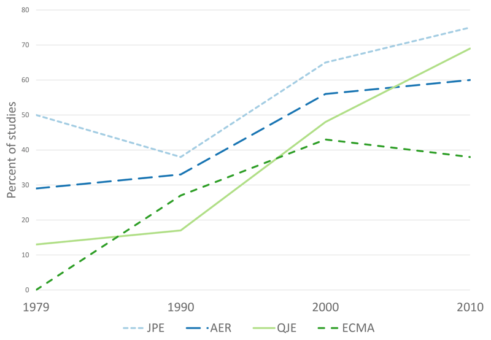
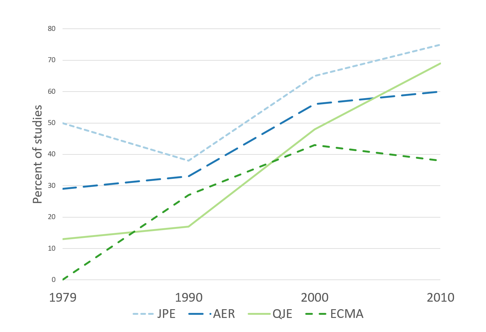
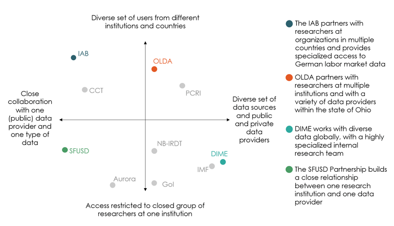

# Using Administrative Data for Research and Evidence-Based Policy: An Introduction {#intro}

```{r, echo=FALSE, results='asis'}
printauthor("intro")
source("programs/_plot_intro.R")
```

## The Potential of Administrative Data for Research and Policymaking

Over the course of our careers, we, the editors of this Handbook, have been witness to extraordinary changes in economics, economic research and evidence informed policymaking. One of them has been the rise of research in applied microeconomics and development economics that focuses on working closely with policymaking and implementing organizations and creating an evidence base for better social programming. Two key factors have contributed to this trend: increased availability of new data sources, and the rapid growth in the use of experiments (randomized control trials or randomized evaluations) in the social sciences. These developments have enabled many new avenues of research.

Recent studies using administrative data show, for instance, how behavioral factors can lead to decision biases, and how these biases can be addressed with better policy design. Improved ways of presenting information have been shown to significantly raise eligible earned-income tax credit (EITC) benefits claims [@bhargava2015], and reduce uptake of costly payday loans [@bertrand2011]. New experimental research has also contributed to the credible assessment of the long-run effects of landmark social programs, such as the effects of Medicaid health insurance in the US on hospital visits, conditional cash transfers through PROGRESA in Mexico on health, or the PACES school voucher program in Columbia on educational outcomes [@taubman2014; @gertler2003; @angrist2006]. Through a better understanding of the pathways of impact, such studies can help improve the design and performance of these programs.

Randomized trials and research evaluating policy impacts more generally have dramatically improved the quality and breadth of evidence used to inform better policymaking. Just within the J-PAL network, affiliated researchers have conducted over 2,000 randomized evaluations and scale-ups of evaluated programs have reached over 500 million people. Moreover, a good number of studies, including the ones cited in the preceding paragraph, make use of existing data sources, typically from administrative databases. Yet it is also our experience that this type of research frequently involves complex and costly original data collection. For example, the large-scale surveys that accompany many randomized evaluations typically consume a large share of the financial and staff resources devoted to the research project overall. A lack of relevant, reliable, and comprehensive data that researchers can access has been a limiting factor for new studies and consequently the spread of evidence-informed policy.

At the same time, there are a wide variety of data sets already in existence, from patient-level health care data in the US to geotagging for police vans and garbage trucks in India [@doshi2016; @thetimesofindia2020], which could dramatically reduce the cost and complexity of policy-relevant research -- including randomized control trials -- and speed up the formation of an evidence base for policymaking. Administrative data are sometimes referred to as *organic data* [@groves2011] because they are generated as part of normal business processes. Decision-makers at firms and in government are often already using such data to better understand problems and issues of the populations they serve. Based on such analytics, new policies are implemented or new questions defined. As a natural next step, carefully designed, systematic research with administrative data, often carried out in partnerships that include academic researchers, firms, and governments, may carry out in-depth analyses, conduct experiments, and develop and field supplemental surveys to test specific mechanisms or hypotheses. This type of innovative research can dramatically expand the insights gained from the data and their feedback to policy.

An increasing fraction of academic studies conducted in high-income countries and published in the most prestigious journals in Economics now use administrative data [see Figure \@ref(fig:introchetty); @chetty2012; and @einav2014]. In general, however, researcher access to administrative data sets remains difficult and idiosyncratic [@card2010], and the potential of administrative data especially in low- and middle-income countries is far from exhausted. This Handbook is motivated by our view that easier access to and an increased use of administrative data sets by researchers could dramatically improve the quantity and quality of available evidence on social programs and policies.

```{r introchetty, fig.cap='Share of studies conducted in high-income countries that use administrative data, among studies published in the four top US journals in Economics (Journal of Political Economy, American Economic Review, Quarterly Journal of Economics, Econometrica). Source: Chetty (2012). Reproduced with permission.', echo=F}
#intrograph1
#knitr::include_graphics('./figures/intrograph1web.png')
if ( knitr::is_html_output() ) {

} 
if ( knitr::is_latex_output() ) {
  if ( ! file.exists('./figures/Chetty-graph.png')) {
    file.copy('./assets/intro/Chetty-graph.png','./figures/Chetty-graph.png')
  }
  
} 
```

The potential benefits of greater access to administrative data are growing exponentially as the scope of data held at governments, non-governmental organizations (NGOs), and private firms is multiplying. For example, both the government and private firms in the US gather salary and employment data, for labor market reports and payroll processing, respectively [@abowd_lehd_2009; @grigsby2020forthcoming]. The data volume processed for these purposes every few months is equivalent in volume to the decennial census of the entire US population. Digital collection of data at the point of origin (as opposed to *ex post* digitization of administrative forms and reports) has already become the norm in high-income countries and is on that path elsewhere in the world.

Administrative data often have very useful properties. They can measure certain features objectively, such as distance traveled, price paid, locations visited, or contacts with a system or provider. This can avoid social desirability or recall biases of survey data. Checks and balances like biometric capture or automatic geotagging can additionally make administrative data more reliable and accurate than self-reported information. These properties themselves may have the potential to make the use of administrative data useful for policy; for example, biometric records used to monitor public health workers in India improved attendance by 15 percent, even when consequences for absentee staff were in practice limited [@dhaliwal2017].

Broad coverage and routine collection as part of day-to-day operations also often make administrative data more representative and may solve an Achilles' heel of many potential surveys and experiments: attrition. The size of administrative data sets can make it possible to run experiments with more treatment arms, and to detect even effects that are small or heterogeneous between groups, without loss of statistical power.

Finally, completely new types of data open exciting new areas of research to improve policies and programs. For example, utility billing, cash register scanning, or phone usage data have provided insights into day-to-day behavior at previously unheard-of levels of detail. The large volume of such data also makes them much more amenable to cutting-edge analysis methods like machine learning, allowing for new classes of insight and inference such as artificial intelligence.

Although firms and NGOs are increasingly making data under their control accessible, governments have long been at the forefront of making data available for research. Examples include labor statistics and social insurance data, but also census data and national, state, and district-level household and firm surveys. When researchers and governments work closely together to conduct research based on administrative data, uniquely fruitful research-policy partnerships can arise that generate innovative, policy-relevant studies. As an early and particularly impressive example, chapter \@ref(indonesia) by Vivi Alatas, Farah Amalia, Abhijit Banerjee, Benjamin A. Olken, Rema Hanna, Sudarno Sumarto, and Putu Poppy Widyasari of this Handbook describes a series of ambitious, nationally representative experiments on the targeting and delivery of social protection programs in Indonesia. This body of work arose out of a decades-long collaboration between academic and World Bank researchers, the national statistical agency of Indonesia, and the Government of Indonesia and had significant influence on Indonesia's policies. These types of partnerships are a promising and important development in social policy research.

Governments, but also NGOs, have begun to see it as part of their mandate to make the information they use for internal programming publicly available, not last. Chapter \@ref(cct) by Hugh Cole, Kelsey Jack, Derek Strong, and Brendan Maughan-Brown describes how the City of Cape Town (CCT) articulates this mandate in its *Data Strategy* by describing administrative data as a "collection of public assets," which should be used to "maximise public benefit". Individual data sets may not be able to provide value infinitely: as pointed out in the [foreword](#foreword) by Daniel L. Goroff and in chapter \@ref(diffpriv) by Alexandra Wood, Micah Altman, Kobbi Nissim, and Salil Vadhan, the value of any data set for generating new statistically valid analyses as well as the ability to protect individuals from identification depletes with use. However, administrative data most often constitute a *flow* of data that is generated at regular intervals or continually over time. Therefore, the value of the agreements, systems, tools, and materials that create or facilitate access to such a recurring or continuous flow of data persist for much longer. A given access mechanism can continue to be used as data covering new time periods become available, and is moreover often flexible enough to be adapted or repurposed as new data types become available for research access.

Public access to data, especially generated by governments and donor-funded organizations, is often considered a value in itself, because it provides transparency on the information being collected and the programs that use this information. Many recent legal reforms reflect this view, such as the Foundations for Evidence-Based Policymaking Act of 2018 in the US or the Digital Economy Act 2017 (Part 5, Digital Government) in the UK, and their equivalents in many other countries. Beyond that, it also enables the broadest possible use of the data in studies on social policies, including by researchers who may not have the resources to collect their own data. In this manner, removing access barriers to data can play an important role in enabling early-career researchers, those working in low-income countries, or those at less well-resourced institutions, to engage in ambitious, high-quality scientific work. At the same time, with a well-designed access mechanism, the organizations providing the data can benefit as well, by having their stored data accessed, cleaned, and analyzed by a broad set of users to provide new insights on key challenges and problems faced by the programs and beneficiaries in their local context.

## Why is the Analysis of Administrative Data Still Relatively Rare?

In light of the tremendous benefits, it is our view that the use of such data for policymaking and research still remains far below its true potential.

Even though most organizations are now collecting administrative data in digital form, many do not yet have the in-house capacity to aggregate and analyze these data before they are overwritten or destroyed after having served their operational purposes. There is often no systematic approach to incorporating data analysis into strategic or operational decision-making. When organizations are analyzing data, it is often for short-term program monitoring, for example through highly aggregated dashboards, rather than carefully designed research. Many data providers, particularly at the sub-national level, are also unfamiliar with the idea of making data available externally, and sometimes lack a clear legal mandate. As a result, these data providers do not have standardized procedures, and are often reluctant to share data at all. At the same time, many researchers have little experience interacting with data providers, having been trained in the traditional model of collecting original data or using secondary (public-use) data in research. In addition to the challenge of negotiating complex data access agreements, researchers face unfamiliar technical hurdles, such as working with data warehouses.

In individual cases, researchers have negotiated one-off or ongoing access to a wide variety of data, in some cases producing influential policy lessons. But they frequently navigate this process without any systematic guidance. Access is often fragile and may depend on the championship of a single individual in the organization. We have also observed organizations with no data use policies and little awareness of the risks of sharing personally identifiable information (PII); in such instances, personal data may unwittingly be exposed to unnecessary risks.

From our own work and that of others, we identify three key challenges for the expanded use of administrative data in research and policy analysis: making the data usable, addressing confidentiality and privacy, and balancing value and costs.

### Making Data Usable for Analysis

Many data providers collect data in outmoded files and disconnected databases, and the data are often not in formats amenable to systematic data analysis [@groves2018; @hand2018]. Data providers interested in research with administrative data would have to commit resources to overhauling their systems and collecting or digitizing key outcomes of interest, and they may not even readily know what type of staff or consultants to hire, what guidelines to set, and how to manage such staff. Data cleaning and data preparation can be especially complex if the goal is to link administrative data with other sources of information (such as survey data) to better understand the extent of the problem, for effective monitoring, or to conduct experiments.

When data linkage, cleaning, curation, and documentation are not performed by the data provider, they must be done by researchers. This work is typically time-intensive but offers limited professional or personal reward; data curation is not an intrinsic part of funded research and is not usually recognized academically. Upon completion of the research, there is little incentive to share prior data curation work with the data provider or other researchers. This leads to duplication of effort and an increased risk of mistakes. Making data usable can be a significant hurdle even for experts. For example, in chapter \@ref(iab) Dana Müller and Philipp vom Berge estimate that the preparation of a given data set for analysis---de-identification, documentation, and test data preparation---takes between fifteen and sixty person-days.

### Protecting Privacy While Promoting the Accessibility and Utility of Data

The unique value of administrative data for policy-relevant analysis and research is often in the level of detail and the personal relevance of the information the data hold. Sources range from medical records to location tracking to employment history. However, these contents also render the data sensitive and make it particularly important to prevent unauthorized access. The privacy of respondents (individuals, such as patients or job seekers, but also firms, hospitals, doctors, etc.) is therefore a key priority when providing research access to administrative data. Respondents whose data appear in administrative data sets have rarely explicitly consented to participate in academic research, and data collection by government agencies, but also by private companies, frequently does not provide individuals with the option to remove or withhold information.

Protecting such personal information is increasingly required by law, but it is also an ethical obligation. Both when a legal framework exists and in cases in which legislation governing the collection and use of the data is imprecise or even absent,[^introduction1] data providers therefore typically endeavor to keep the identity and attributes of the individuals, firms, and institutions in the data confidential. When there is no clearly defined process or mandate for providing data for research purposes to individuals outside the immediate set of staff responsible for the data, data providers will justifiably be conservative about whom they entrust with access.

A range of tools are available to protect personal information in administrative data, and these tools are a focus of both the thematic chapters as well as the case studies in this Handbook. However, those mechanisms require expertise to implement, and they also affect how the data can be used. An important instance of this is the editing of data to reduce the chance that a person or computer could identify, or attempt to identify, specific people or attributes of those people. Aggregating, coarsening, or removing personal details in the data are standard tools of statistical disclosure limitation (SDL), but the increase in protection almost always comes at the cost of reducing the data's utility for analysis (see chapter \@ref(discavoid) by Ian M. Schmutte and Lars Vilhuber); in fact, some types of research are only possible when individuals are personally identified. This includes experiments in which different interventions are provided to different groups to assess their effects: it is typically necessary to at least temporarily work with identified data in order to know who received which program or program variant.

Most other security requirements also have the potential to reduce the set of data users either in principle or in practice: data may be protected by requiring access with a specific device, at specific times, or at a unique location such as a secure room (see chapter \@ref(security) by Jim Shen and Lars Vilhuber); or the data provider may restrict access to certain groups, such as researchers affiliated with an academic institution. The data provider therefore needs to weigh these restrictions against the likelihood of data breaches occurring and the damage that would result, and this can be a challenging exercise. A focus of the many case studies in this Handbook, and a large number of implementations documented elsewhere, is to find feasible solutions that are useful for researchers, sustainable to data providers, and respectful of respondents' privacy.

### Value vs. Cost

The processes involved in both making data usable and protecting individuals' privacy can be relatively simple, but may also require significant resources, and it may not always be clear at the outset which it is. Some data providers may perceive risks of making data accessible for research (such as the reputational risk of publications being negatively received by the public or their superiors, or the legal and ethical risk associated with possible data breaches) while not being sure as to what the benefits of research will be and how it will feed back into decision-making. This is compounded by the fact that data providers may not have a full view of how data analysis can improve strategic and operational decision-making or what research is possible; or they attribute low value to the insights that could be generated, perhaps because they do not internalize the generalizable lessons from such research.

Researchers may also not always know how to add value for data providers. Developing dashboards drawing on the data, creating summary statistics or research briefs that give the provider or the general public a sense of the provider's activities, suggesting implementable measures to streamline operations, and generally helping the data provider to assess and showcase the value-added, are activities that are not part of the regular skill set of academic researchers.

On the researcher side, significant time and effort may be needed to negotiate and obtain data access when robust and well-documented request and access procedures for administrative data are not yet established. Prominent universities or researchers may be at an advantage (real or perceived) in terms of the resources they can devote to this work. The investment may discourage some potential users, including those from low-income countries. Successful data access mechanisms must be able to address all these points: provide value to both data providers and researchers, commit resources to policy-relevant analysis and to translating research insights into actionable recommendations, and deliver fast and streamlined data access and use.

Another salient feature of administrative data access is that the costs are frontloaded. Once a data set has been cleaned and curated, the data are readily available for use in any number of research projects. Similarly, establishing data access procedures can be a costly and time-intensive process, including finding solutions for privacy issues, creating buy-in from all stakeholders, and defining and formulating responsibilities, conventions, and rules. However, this initial investment could enable much faster access requests in the future. The cost hurdle is in many cases too high to overcome for a single researcher or a single research project even if the continued use of the data would justify this cost. Two possible solutions are either to distribute the costs among several research teams who will get access to the data, or to dedicate resources at the data provider to covering the initial fixed costs of creating access and overcoming capacity bottlenecks.

## This Handbook

While the questions outlined above are challenging, many institutions have developed effective and replicable solutions to share administrative data with researchers. These institutions have made data usable and put data security measures and privacy policies in place in a manner that created long-term value for both data providers and researchers. The Handbook draws inspiration from these successes.

To date, much of the existing literature has focused on high-level considerations and the restricted-access data landscape (see the list of additional resources at the end of this chapter) but has very little practical information. In particular, there is a lack of tangible, concrete advice for sub-national organizations that wish to make confidential administrative microdata accessible in a responsible fashion, even though researchers, governments, NGOs, and private firms have consistently expressed interest in learning from experiences around the world. There are gaps on a range of topics: drafting data use agreements, cleaning and linking data sets, implementing secure computer systems and managing the data infrastructure, designing an application workflow for granting access to multiple researchers, analyzing data for decision-making, and facilitating collaborations between researchers and data providers.

With this Handbook, we aim to close these gaps and to provide researchers and data providers with guidance on best practices in legal and technical areas; and perhaps just as importantly, we hope to furnish a set of compelling examples of success that can serve as inspiration for others. We believe that the practical and actionable lessons from these cases can provide valuable information to other institutions, data providers, and researchers on how to securely and easily share, access, and analyze administrative data. Additionally, as mentioned at the beginning of this introduction, we see an incredible opportunity in combining the use of administrative data with field experiments and supplemental survey data, something which to date is relatively rare and for which almost no guidance exists. Several chapters in this Handbook therefore make explicit reference to this goal. We hope that this will inspire innovative experiments based on administrative data that will generate insights on the impact of policies and programs worldwide.

The first part of the Handbook consists of in-depth and practical thematic chapters on technical and legal issues surrounding administrative data access. The second part provides structured case studies of different data access mechanisms and research projects that illustrate how to succeed in a wide variety of legal and technical environments. We here briefly describe each of them.

### Different Levers for Protecting Sensitive Data: The Thematic Chapters

The thematic chapters of the Handbook provide guidance on four topics: how to align administrative data use and institutional review board--compliant research, how to craft data use agreements (DUA) between data providers and researchers, how to protect the data physically, and how to use computational and statistical techniques to conceal the identity of individuals in the data. In this manner, these chapters cover a set of interlinked ways of protecting personal data: physical, legal, and analytical.

Chapter \@ref(security) discusses the hardware and software necessary to provide secure access to data, covering topics such as data encryption, user authorization through security tokens, biometric identification, and secure-room setups. Along with standard safety measures such as password protection, physical security shields the data primarily from unauthorized access, be it malicious hacking or inadvertent looks taken at someone else's screen. Data providers can stipulate or provide the necessary hardware and software in order to keep data secure.

Analytical techniques to protect data deter or prevent unauthorized use. A range of such statistical disclosure limitation methods are described in chapter \@ref(discavoid). The chapter covers techniques to avoid inadvertent identification of individuals, either from the data directly or from summaries, analyses, or visualizations. SDL provides methods to "blur" the data so that individual observations may be obfuscated, but aggregates or analyses (such as averages, counts, or model-based parameters) remain within certain bounds and can be used for meaningful analysis and comparison. Traditional SDL methods are already widely in use, and the chapter describes methods that allow data custodians to assess how much to modify the data to achieve sufficient protection and how much subsequent analyses might be affected. A relatively new approach to this question is differential privacy, described in chapter \@ref(diffpriv). Differentially private methods provide strong promises to prevent outside parties from learning whether any individual is in the data, regardless of the background information available to others. In this it differs from traditional methods, which typically protect against specific, rather than general, methods of breaching privacy. Differentially private methods are being used more and more for releases of tabular data, for instance by the US Census Bureau [@machanavajjhala_privacy_2008], Google [@erlingsson2014], Apple [@differentialprivacyteam2017], SafeGraph [@safegraph2020], but can also be challenging to implement. Chapter \@ref(diffpriv) provides an overview and details on the advantages and challenges of implementing differential privacy.

The chapters on data use agreements and institutional review boards (chapter \@ref(irb) by Kathleen Murphy and chapter \@ref(dua) by Amy O'Hara, respectively) broadly fall under legal protections. Legal protections primarily serve to regulate the use of the data by authorized users.

An important element of legal data protection is the data use agreement (DUA) between the researcher and the data provider, which governs how the data are used and accessed, and can require researchers to implement, or be subject to, physical and analytical protections. A DUA can also stipulate reviews or audits, as well as sanctions in cases of violations. Conversely, the DUA can specify what data uses are permitted, when the data needs to be provided, and how results can be published. In this manner, DUAs ensure that the interests of the data provider, the researcher, and the individuals in the data are preserved. Chapter \@ref(dua) describes the process of drafting a DUA and provides a flexible template.

Lastly, chapter \@ref(irb) describes the process of US federal regulatory review of individual research projects for the protection of subjects and specifically the principles and guidelines that institutional review boards (IRBs) apply in such review. In the US and elsewhere, ethics review is required for most research with human subjects. From the perspective of the data provider, a requirement of IRB approval, potentially built into the DUA, can serve as an opportunity for an external and unbiased review of the balance between the burdens and benefits of the research and any risks to which individuals in the data might be exposed. The IRB can thus help the data provider and the researcher assess the risk that a data breach or misuse of the data might bring and oblige the researcher to think through data security and analysis strategies that help minimize these risks. Conversely, the chapter also clarifies whose interests or what uses of data an IRB does not protect and which therefore need to be regulated in other ways if any party of the administrative data collaboration wishes for such regulation.

### Data Protection in Practice: The Five Safes in the Case Studies

In practice, any solution for creating administrative data access needs to take into account the unique circumstances of the data and data provider in question. Factors to consider include

- the intended uses of the data and analysis;
- the different interests of all partners;
- idiosyncratic issues, needs, or requirements of the data provider and the researchers involved;
- specifics of the location and the legislative and institutional frameworks; and
- the content and structure of the data.

The general guidance provided in the thematic chapters addresses these needs only partially; successful solutions employ the available set of tools in creative ways and combine different protection methods into a coherent whole. As illustrated in chapter \@ref(iab), some data providers may decide to provide a menu of various combinations of SDL, physical security, and legal constraints to cover various degrees of analytical fidelity and feasibility of research projects.

To showcase such solutions, we have selected an array of case studies that have implemented robust, innovative, and sustainable data access mechanisms and processes. Table \@ref(tab:introtable1) gives an overview of all the case study chapters. We asked the authors to describe their data protection solutions using the Five Safes framework [@desai2016] as an organizing principle.[^introduction2] Each of the *safes* describes one aspect in which an access model reduces the risk of unauthorized release of personal information.

```{r introtable1, tidy=FALSE, echo=F,results='asis'}
if ( knitr::is_html_output() ) {
    introtable1()
}
if ( knitr::is_latex_output() ) {
  cat("\\input{./tables/intro/introtable1.tex}")
}

```

*Safe projects* describe how the data provider goes about assessing projects for appropriateness. In order to ensure data protections that are commensurate with the risk involved, and more generally to ensure ethical conduct of the research, safe projects may include, for example, a requirement of ethics (IRB) review but also a policy-focused review by data provider staff.

*Safe people* discusses what criteria are used for identifying researchers who are granted data access. For example, affiliation or training requirements may be a tool to ensure that the user has the necessary qualifications to draw accurate conclusions from the data or that the researcher is not subject to a financial conflict of interest. Safe projects and safe people often interact; for example, when data can be used by only a select group of people whose intentions and qualifications are assured, it may not be necessary to review each individual project before granting access. As an edge case, consider the World Bank (chapter \@ref(dime) by Arianna Legovini and Maria Ruth Jones), where the research staff with data access are directly employed by the organization; the World Bank applies its internal standards of ethical conduct to all staff but does not require external ethics review.

*Safe settings* describe the environment in which data access is permitted and shows how physical security is implemented in practice. The concrete implementation choices showcased in the case studies complement the overview of the different methods provided in chapter \@ref(security) and illustrate the diversity of possible approaches.

For example, in the Ohio Longitudinal Data Archive (OLDA) partnership (chapter \@ref(olda) by Joshua D. Hawley), data access may occur from the researcher's own computer, but the file transfer protocol only admits identified devices that were previously registered. The Institute for Employment Research (IAB)---chapter \@ref(iab)---requires that all users access the data through hardware that fulfills a specific set of client specifications, and until 2018, required a dedicated thin client, a stripped-down device that has no functionalities other than logging onto the central data server.

How stringent the physical protection measures are may again partly depend on what groups of people are given access (safe people), but also on how sensitive the data are (safe data), either for privacy or intellectual property reasons; for example, only secure rooms or similar physical access-restricted setups can reliably protect from unauthorized parties snapping images of a user screen.

*Safe data* covers how analytical protection methods, such as those described in chapters \@ref(discavoid) and \@ref(diffpriv), are implemented to minimize disclosure risk when the data are stored or viewed. These methods protect from inadvertent disclosure by data provider staff, by researchers accessing the data, or during data transfer. They may also protect from unauthorized attempts to identify individuals in the data by users who were given data access. IRB review is often more straightforward when personal information is protected in this manner, which provides an incentive for researchers to prefer analytical protection methods.

While disclosure protection procedures such as the masking of identifiers are in principle straightforward, the case study examples often reveal complexities in the details. As an example, chapter \@ref(ahc) by Laura Feeney and Amy Finkelstein describes their work with Aurora Health Care. Aurora implemented a de-identification system in which personally identifiable information is replaced by an anonymous ID number before any data were shared. However, as new patients appear in the data, the de-identification procedure needs to create new, unique anonymous numbers for the patients and, moreover, the system must be able to link different data sets via this unique ID in order to combine a variety of data sources. At the same time, the procedure must not inadvertently allow a reconstruction of the underlying information; for example, the ID number cannot be calculated in a deterministic way from the person's date of birth or similar information. In successful partnerships, privacy expertise contributes not only to solving issues such as this one but also to identifying challenges before they occur.

*Safe outputs* are about minimizing the disclosure risk that stems from the *publication* of analytical results and other outputs, again by applying the tools of SDL outlined earlier. The information of individuals must remain hidden as researchers describe the data or cases in the data, create tables, or display graphs. Safe outputs can even mean withholding the name of the data provider in order to protect the research partners or the individuals whose data are used in the research.

Again, safe outputs interact with the other four safes. For example, where the selected researchers have significant data expertise and their proposals undergo IRB review, the data provider may rely on the DUA to stipulate only *ex post* review of outputs for disclosure risk as described in chapters \@ref(discavoid) and \@ref(diffpriv). By contrast, in cases where the user base is broader, the data provider may choose to permit data analysis only in-house (i.e., through remote access) and only release publishable results to the user after performing SDL review, possibly requiring alterations of outputs such as summary tables or regression coefficients.

Implicit in each case study is a global assessment of the risks involved. These risks are typically not explicitly articulated (except in some instances through the legal framework) but risks guide the data protection choices made by each data provider. Thus, each case study represents a particular set of choices guided by the tradeoff between ease of access on the one hand and the unmitigated risks on the other.

In addition to discussing their particular implementation of the Five Safes framework, each case study also describes how the data were made usable, the institutional setup, the specific legal framework for data access and data use, sustainability (outreach activities undertaken, revenue generated or accounted for, and metrics for success), and aspects of robustness and reproducibility. These round out the data access mechanism examples and point the reader to a diverse range of solutions.

The chosen structure allows readers to either engage with individual chapters, or to focus on specific aspects of administrative data access across multiple case studies. For instance, the reader may want peruse specifically the section that describes how *safe people* are selected in each chapter.

### Institutional Models of Access {#intro-institutionalmodels}

As discussed above, in many situations where administrative data could be analyzed for research and policy purposes, there is an initial hurdle to overcome in which researchers and data providers face a range of one-off costs and activities. The structure and requirements of this process are described in the section on institutional setup in each chapter. On the data provider side, once an application process has been created, permissions have been obtained, and a data set cleaned, additional users could access the data at low additional expense. On the researcher side, investments may have to be made upfront as well, from building skills to learning about the data structure to forming a relationship with a data provider. Afterwards, multiple research projects may become possible with the same data provider, and skills are transferable to projects with different data providers.

Relatedly, one data provider might be able to supply many different data sets or periodically update the same data sets over many time periods, creating panel data for the same individuals or repeated cross-sections of representative samples. It is often beneficial for creating new research and policy insights to link different types of data and combine, for example, labor market data with education data. The OLDA provides an example of this (chapter \@ref(olda)).

In all these cases, there are significant economies of scale or scope when creating administrative data access. Accordingly, many successful data access mechanisms bundle access, for example by managing multiple users, tapping multiple data sources within an organization, combining data sets from multiple data providers, or conducting multiple projects within the same or similar government-researcher partnerships.

Our case studies span data from the public and the private sector and many different data-hosting organizations from governments and international institutions to academic research centers. However, not by coincidence, most of our case studies describe data access mechanisms that in one way or another harness benefits from specialization, bundling, or scale economies.


```{r introfig1, fig.cap='A schematic illustration of the range of possible institutional arrangements for a data provider, realizing economies of scale and scope at different levels.', echo=F}
if ( knitr::is_html_output() ) {

} 
if ( knitr::is_latex_output() ) {
  if ( ! file.exists('./figures/intro/introfigure1.png')) {
    file.copy('./assets/intro/introfigure1.png','./figures/introfigure1.png')
  }
  knitr::include_graphics('./figures/introfigure1.png')
} 
```

Figure \@ref(fig:introfig1) provides something of a taxonomy in regard to specialization and scope by placing the different access models of the case studies on two axes: the diversity of data or data providers and the diversity of users. There is the greatest potential for realizing specialization benefits or economies of scale when all researchers are affiliated with the same organization or when all data is similar and comes from the same data provider. The former means for example that user access protocols or security requirements can be tailored to one specific set of users, whereas the latter means that they can be customized and automated for the needs of one data provider, but also that staff will be able to develop deep expertise regarding the data and its idiosyncrasies. Economies of scope are more likely to be realized when many different users access the same data or when the same team of experts works with many different types of data sets or data providers, for example by building transferable expertise or utilizing systems and infrastructure to capacity.

In one type of model for administrative data access, these benefits are realized by **a center or unit in long-term partnership with an institutional partner** that provides different data sets or the same type of data over many periods of time. Excellent examples in our case studies are chapter \@ref(sfusd) by Moonhawk Kim, Jim Shen, Laura Wentworth, Norma Ming, Michelle Reininger, and Eric Bettinger describing the Stanford-San Francisco Unified School District Partnership or chapter \@ref(iab) describing the IAB. In these settings, relationship-building between the data intermediary and the data provider and careful design of the legal and institutional framework ensure that policy interests and research conducted with the data are closely aligned.

A dedicated data access center can provide additional value by creating access for data provider staff for policy analysis (or conducting such analysis) and by maintaining policy engagement after the research ends. Appropriate data use agreements can encourage researchers to contribute data cleaning, data documentation, or policy analysis to the center. Since the partnership is close and the data and its possible uses are well circumscribed, data extraction processes can typically be streamlined and partially automated, and DUAs can follow a template, facilitating and speeding up access for the benefit of all parties. Vibrant administrative research centers can also create a local ecosystem of like-minded experts and provide technical training and attractive prospects for high-caliber researchers and staff.

Many **mature systems for research data access are hosted by universities that collaborate with specific governments**. Aside from the Stanford-SFUSD Partnership and the IAB, another example of this in the Handbook is the OLDA. The advantages of hosting the data at academic institutions are many: they often have an ethics review board (IRB) or can provide support for ethics review, they manage grants, they can supply space and an existing computing infrastructure, and can provide channels to other researchers as well as audiences (conferences, seminars, plenary discussions, events, etc.). Postdoctoral researchers and graduate and undergraduate students can contribute their skills to the data work; access to the data for their own research may provide additional incentives. Universities are often seen as more independent and less political or partisan than other policy research organizations such as think tanks. Chapter \@ref(olda) describes how OLDA's institutionalization as a center at Ohio State University facilitated long-term research projects across legislative cycles and associated changes in policy priorities.

An alternative model involves locating a **data-sharing center within the data provider** as done in by the IAB (chapter \@ref(iab)) and the City of Cape Town (chapter \@ref(cct)). This has the advantage of ensuring that the data provider maintains a high level of oversight and control. It also can allow a wider user base since academic partnerships often restrict access to affiliated researchers. On the other hand, this type of access mechanism cannot take full advantage of the resources and capabilities of academic partnerships. Government entities, for example, may have limited resources and are often prohibited from accepting grant financing.

In some cases, hybrid models are employed where a **university research center embeds staff with the data provider**, thus supplying the staff resources and university access while the data remains under the control of the data provider. This is an approach that the Abdul Latif Jameel Poverty Action Lab (J-PAL) has used in the past in a partnership with the Government of Tamil Nadu through the IDEA Lab in South Asia. Another path, taken by the Private Capital Research Institute (PCRI, chapter \@ref(pcri)) by Josh Lerner, Leslie Jeng, and Therese Juneau), is to create an **entirely separate non-profit organization** with its own governance structures, while only housing the final data at a university-affiliated data archive. Such an approach may achieve some of the benefits of university location, such as trust in academic independence and clear governance, without incurring some of the bureaucratic and overhead expenses associated with universities.

Yet another type of successful data access model does not rely on a data intermediary but instead makes use of the benefits of specialization by assembling a **team of experts and researchers who interact with a wide range of potential data providers**. Chapter \@ref(dime) by Arianna Legovini and Maria Ruth Jones describes how the Development Impact Monitoring and Evaluation unit (DIME) at the World Bank conducts research projects with a range of government and private sector data providers. Chapter \@ref(imf) by Era Dabla-Norris, Federico J. Diez, and Romain Duval illustrates how the International Monetary Fund (IMF) works with many different national governments streamlining, standardizing, and analyzing tax data.

The DIME and IMF chapters highlight what a specialized researcher team can do in terms of ensuring high-quality data collection, integration with experiments, and cutting-edge best practices for data analysis, such as building systems to ensure that individual researchers make their results reproducible. This model may be particularly interesting for large policy organizations, such as international multilaterals and NGOs or similar institutions, but the model can also be attractive for a small team of academic collaborators or for private companies with capacity for a research group. Large organizations can take full advantage of a coordinated team of highly trained researchers who can build expertise for specific types of administrative data and apply that expertise in a range of partnerships with different data providers. One potential downside can be that researchers external to the organization have no or only restricted access to the data. DIME was able to successfully avoid this issue through collaborations between internal and external researchers, which can serve as an encouraging example to other organizations who take similar approaches. In this way, external researchers can contribute to the exchange of ideas and increase the amount of research that can be done beyond the limits imposed by internal research capacity.

### Balancing Interests and Creating value for All Partners

An important aspect of setting up administrative data access for research and policy analysis that is successful in the long term is to ensure that the interests of all stakeholders are served. Stakeholders include the individuals whose information are contained in the data, but also the data provider and data intermediaries, the researchers who are conducting the data analysis, the academic and policy communities, and the general public.

Protections for personally identifiable information were discussed in detail earlier. However, data providers often have other reasons besides privacy to protect the content or provenance of administrative data and steer the research taking place. Data on the operation of large-scale policy programs, taxation or spending, and other information are often sensitive for political, legal, criminal justice, or national security reasons. Private companies have an interest in protecting their brand name, maintaining the trust of their customers and clients, and keeping legal rights over valuable data they own or create. Differences in priorities and interests can even occur within the same data-providing organization. For example, as the authors of chapter \@ref(cct) point out, those charged with storage and governance of the data are often more conservative in the uses they consider permissible than the branches of the organization that provide services and whose operations would benefit from better data analysis.

The case studies describe a variety of ways in which data access mechanisms can resolve these tensions. For example, the PCRI (chapter \@ref(pcri)) has data use agreements with private companies that keep the firm's name anonymous and ensure that any analysis done with the data is for non-profit, academic research, and the data can never be directly accessed by users. These reassurances have enabled the PCRI to assemble an impressive amount of data from a famously reserved industry. Chapter \@ref(imf) explains that the immunity of the IMF greatly facilitates cooperation with governments and tax authorities, because the IMF protects data from any access outside the Fund itself, including by members of the same country or government that supplied the data. In the national context, most statistical agencies are required to protect their data and are exempt from responding to requests by law enforcement, for example. The United Nations' [Fundamental Principles of Official Statistics](https://unstats.un.org/unsd/dnss/gp/fundprinciples.aspx), first adopted in 1994, requires in Principle 6 that "individual data ... be strictly confidential and used exclusively for statistical purposes" [@unitednations2014]. An external data intermediary and the right legal framework could emulate such guarantees in other contexts.

Several data intermediaries in the case studies have also established formal review by the data provider to ensure alignment of any research projects with policy goals: the OLDA has a multi-stage review process starting with a one-page proposal and in the Stanford-SFUSD Partnership, the school district conducts what they call ABC review (alignments, benefits, and costs). Chapter \@ref(olda) also mentions that being able to fall back on a formal review process is helpful when dealing with unusual data requests, possibly from powerful actors, as it protects all parties from misuse---of the data as well as of the resources invested to curate and provide the data.

When instituting a review process, it is important to ensure that the interests of researchers and the public are both protected, meaning that the independence of the research is guaranteed, in order to maintain full credibility of research findings. For example, data use agreements might specify that identifying details of the data provider may be withheld, but the data provider cannot revoke permission to use the data *ex post*. Without this protection, academic freedom is curbed, and researchers may spend time and resources on a project that they later cannot publish; in the long run, such approaches would likely stifle research use of data and introduce systematic biases in research results.

Public data providers, such as government agencies, are bound to uphold the interest of citizens and the public good. In the eyes of a public servant, this goal may conflict with costly investments in data analysis with uncertain benefits. The strongest incentive for undertaking more formal access to administrative data is therefore often an explicit legal mandate. Chapter \@ref(olda) gives a compelling description of the role of federal funding as a signal of endorsement by the national government, which spurred action at the state level to make Ohio's labor data accessible. Similarly, chapter \@ref(iab) on the IAB and chapter \@ref(nbirdt) by Donna Curtis Maillet and James Ted McDonald on the NB-IRDT describe the legal mandate of those institutions to create access to vital administrative data under these institutions' care. The City of Cape Town (chapter \@ref(cct)) underwent a concerted shift in institutional priorities with a formal new data policy that put the focus on open access to data.

Lastly, systematized access to administrative data can be designed in such a way that the data intermediary or the researchers who benefit from access to the data for their own research agenda give back and provide value to the data provider in the form of technical expertise, policy advice, or data analysis. The OLDA, for example, has a sophisticated outreach program with *data days* and a [Workforce Success Measures dashboard](https://workforcesuccess.chrr.ohio-state.edu/home) for the public. Researchers could also provide training and capacity building for the data provider. The City of Cape Town requires researchers to share tools and analysis files with CCT staff.

A last important trade-off concerns the streamlining of access and the opportunities to combine administrative data with identified data, for example to conduct experiments. Automated disclosure avoidance measures make it simpler to protect data, but restrict access to personally identifiable information. The power of administrative data for experiments lies in the potential to not just analyze the data but actively combine the identified data with other sources to conduct experimental interventions. The earliest established administrative data centers have focused almost exclusively on making data available for observational research. This has the advantage that identifiers can be removed from the data early and, consequently, research use has typically been low risk for the privacy of those in the data. In many cases, observational studies allow the data provider to take a relatively light-touch role in the request and access process. However, observational research foregoes the significant potential and advantages of conducting randomized control trials in which administrative data are used to assess the effects of certain policies.

This Handbook contains compelling examples of creating systematized, ongoing capacity to conduct randomized field experiments using administrative data. As far as research undertakings go, these are perhaps the most complex. In particular, close cooperation between the researcher and the data provider is typically necessary. On the one hand, the research and program delivery teams need to know the identity of individuals in the study sample in order to link administrative data with treatment group assignment. This may require more involved procedures to satisfy legal or ethical mandates for the protection of individual data. On the other hand, the data provider will often also act as the program provider. For an experiment, this requires implementing the randomization procedure and adhering to the assignment of study participants into different treatment groups.

There are currently few experiments that involve large samples and the systematic use of administrative data. However, chapter \@ref(ahc) on the Aurora Health Care cooperation shows that a close research partnership and the right data curation procedures can allow compelling experiments while making only de-identified data accessible to researchers. Chapter \@ref(indonesia) showcases the collaboration of the Government of Indonesia with a team of academic and non-academic development economists, which has linked large-scale randomized trials to an ongoing policymaking agenda. The chapter points out that administrative data can play a role at multiple stages of an experiment---be it to provide the sampling frame or to monitor the reach of interventions and provide important program outcome data. The multi-year collaboration between J-PAL Southeast Asia and the Government of Indonesia involved both using administrative records to evaluate interventions and implementing data collection for experiments as part of a national statistical survey. These chapters give a glimpse of the possibilities that open when researchers and policy organizations truly work as partners in using administrative data for policy analysis.

## Further Reading

For information beyond the scope of this Handbook, we refer readers to a number of excellent starting points on a range of topics: the various challenges of making data available securely [see @reuter2010; @harron2017; @adrfnetwork2018; @futureofprivacyforum2017]; resources on data held by national statistical offices (NSO) and the initial creation of integrated data systems, including (in the US) work by Actionable Intelligence for Social Policy (AISP); and guides for the European context, which include case studies of national statistical agencies [@oecd2014; @bujnowska2019].

The existing literature also provides high-level guidance on numerous topics, including the following: methods to transparently select and authorize access applications at scale and to evaluate whether researchers are trustworthy [for a new approach, see @levenstein2018]; data use agreements that fit within the broader legal framework [some limited guidance provided by @kanous2015; @kuchinke2016; @alter2018]; access modalities such as providing a secure computing infrastructure with local or remote access [@weinberg2007; @vilhuber2013; @vilhuber2017]; tools to apply statistical disclosure limitation to the output of analysis conducted using the organization's data [@liu2020; @dupriez2010; @duncan2011]; complementary data publication mechanisms such as public-use or scientific-use data [@bujnowska2019]; and how to publish information on and access modalities for confidential data [@abowd2012].

[^introduction1]: Notable examples in which privacy is only minimally protected includes information about the employees of the United States federal government or property tax records in many US counties.

[^introduction2]: The Five Safes framework is broadly and internationally used as a guiding principle by national statistical agencies [@australianbureauofstatistics2017; @statisticscanada2018] and provinces and individual agencies [see e.g., Province of British Columbia, @bcministryofcitizensservices]. @altman2015 suggest an alternative framing.

\putbib
