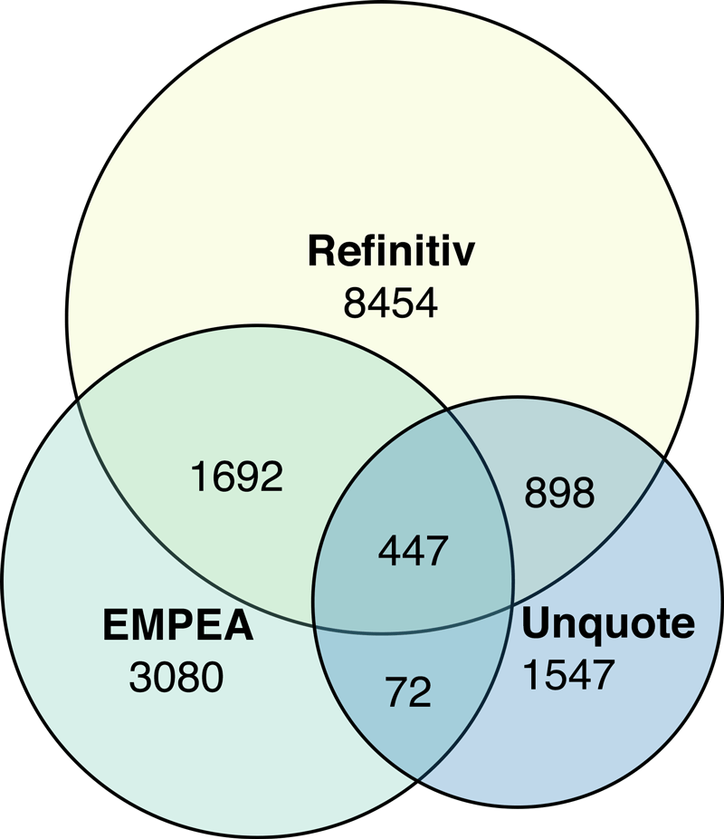

# The Private Capital Research Institute: Making Private Data Accessible in an Opaque Industry

```{r, echo=FALSE, results='asis'}
printauthor("pcri")
```

## Summary

The Private Capital Research Institute (PCRI) is a non-profit corporation that seeks to understand the fundamental economics of private capital.[^pcri2] A wide variety of forms of private capital are examined, including angel investors, venture capital and private equity organizations, and public providers of private capital (e.g., sovereign wealth funds).

The PCRI grew out of a multi-year research initiative sponsored by the World Economic Forum that studied the economic impact of private equity [@gurung2008].[^pcri3] The PCRI received initial support from the Ewing Marion Kauffman Foundation and continues to be funded through grants and strategic relationships.

The principal activities of the PCRI are (a) build data sets related to private capital that can be made available to researchers for analysis (See Appendix A for the PCRI database summary information), (b) build up a community of scholars and sponsor independent academic research on the nature and effects of private capital, and (c) disseminate the findings of this research to policymakers and the public at large to foster deeper understanding of the role that private capital plays in the economy and society.

The PCRI collects data from commercial data vendors as well as the private equity firms themselves. In addition, the PCRI collects data from primary sources, such as publicly available filings. One of the more recent projects is the gathering of public filings called ||**Certificates of Incorporation (CoIs**)|| from states of incorporation.

The PCRI databases are available to all academic researchers with a credible research agenda. Additionally, safeguarding PCRI's independence from outside influence is critically important. Thus, the PCRI only accepts funding from entities or individuals who recognize that the value of the PCRI's research and analysis depends on an analytically rigorous and unbiased process.

## Introduction

### Motivation and Background

The level of interest in alternative investments, and private capital in particular (which encompasses both venture capital (VC) and private equity), has been intense over the past decade. This interest has stemmed from both investors' desires for attractive returns and the policy questions around this rapidly growing asset class.

Returns from the United States publicly traded equities, the mainstays of investment portfolios for individuals and institutions, are projected by many analysts to be substantially weaker going forward, while exceedingly low interest rates suggest limited future returns for bonds [@perianan2020].Many other classes of alternative investments, such as hedge funds and real estate, have struggled in recent years to match market benchmarks. Concurrently, many public pension funds are facing severe shortfalls, and other institutional investors---from university endowments to sovereign wealth funds---are seeking additional funds to fulfill ambitious agendas. As a result, institutions are increasingly looking to private capital investments such as venture capital, buyout, and growth funds. The global private capital pool reached US\$714 billion in 2018, up from US\$324 billion a decade ago [@baincompany2019].

This growth has, in turn, raised questions about the consequences of these investments for companies, workers, and the economy more generally [@privatecapitalresearchinstitute2017]. In particular, policymakers have enacted and proposed several initiatives in the past decade to address the perceived harms of private equity. For example, the European Union implemented an [Alternative Investment Fund Managers Directive]( https://eur-lex.europa.eu/legal-content/EN/TXT/PDF/?uri=CELEX:32011L0061&from=EN) to prevent asset stripping from private firms after acquisition by private equity or other financial sponsors (see Chapters IV and V, especially Chapter V, Section 2, Articles 26--30). As another example, the European Central Bank (ECB) [guidance on leveraged transactions]( https://www.bankingsupervision.europa.eu/ecb/pub/pdf/ssm.leveraged_transactions_guidance_201705.en.pdf) requires stringent internal review of "all types of loan or credit exposures where the borrower is owned by one or more financial sponsors."[^pcri4] Additionally, in 2019 United States Senator Elizabeth Warren introduced the [Stop Wall Street Looting Act]( https://www.warren.senate.gov/imo/media/doc/2019.7.17%20Stop%20Wall%20Street%20Looting%20Act%20Text.pdf ) (see Section 3(13)) to broadly regulate private equity in the United States. Fears about the high indebtedness of buyouts and their potential risk to the stability of the financial system animated United States regulatory guidance of leveraged lending to facilitate buyouts and post-buyout activities of target firms.

Although the global economy and individual investors are increasingly dependent on private capital, much remains poorly understood about these investments. A salient aspect of private capital is that it is indeed private. Traditionally, the general partners (GPs) who manage these funds have not disclosed much information to the United States Securities and Exchange Commission, other regulators, or even to their own investors (limited partners, or LPs). A shortage of reliable industry data leads to an unappealing setting where industry advocates make sweeping claims about the benefits and critics make broad charges on very shaky empirical foundations [@kaplan2017].

This lack of transparency has led to two important barriers to private capital research. First, there have been barriers to entry: it has been difficult for academic researchers, graduate students and junior faculty, to get access to these records. Second, much of the research has been undertaken using commercial databases (most notably, Thomson Reuters, which has a licensing program, and Burgiss, which has made its data available to the [Private Equity Research Consortium](http://uncipc.org/index.php/initiativecat/private-equity/) based at the University of North Carolina at Chapel Hill) or else using data provided to researchers directly by limited and general partners on a one-off basis (e.g., @gompers1997).

It is typically difficult to compare any but the basic facts about the various commercial databases, as these databases draw from different sources, some of which may be proprietary.[^pcri1] As a result, there are contradictory findings on a number of important topics, such as the risk-adjusted performance of private equity and the extent of persistence of performance of funds: the differences in results appear to be at least in part a function of the differences between databases. On the former topic, see @korteweg2019; on the latter, see @braun2017, @harris2014, and @korteweg2015. These issues are akin to the more general issues of access to private data raised by the American Economic Association's Committee on Economic Statistics.[^pcri5]

The Private Capital Research Institute (PCRI) was initially founded to address these data issues and to provide a greater fact-based understanding of private capital's global impact. Thus, the PCRI's goal is to create a standardized database on the private capital industry. Since 2010, an important part of the PCRI effort has been the building of a series of comprehensive private capital databases to serve as the foundation for independent analysis of the economic impact of private capital and the performance of funds and individual transactions.

The PCRI uses two strategies to gather data. One approach is to collect data directly from primary and secondary sources: the private capital firms themselves and commercial data vendors, respectively. Thus, a large part of this process has been formulating ||**licensing agreements**|| with the two types of data providers. An alternative strategy to further address these data issues is to gather data on private firms from public filings.

An example of this second strategy is a recent initiative of the PCRI: the creation of a library of ||**CoIs**|| and related documents to allow more researchers to explore the important topics in this area. A few academic papers have utilized the information found in ||**CoIs**|| to explore questions around capital structure and contractual terms of private capital investments and corporate governance issues. These studies, however, have used extremely limited proprietary data sets, making it difficult to replicate or refute the studies.

For example, one of the pioneering academic papers to explore topics in this area is @kaplan2003, which examines 213 venture capital investments in 119 portfolio companies by fourteen VC firms and provides an empirical analysis of the contracts used. To obtain the data for this study, the researchers created a proprietary data set by asking fourteen VC firms to provide detailed information on their portfolio companies, which included financing terms, the firms' equity ownership, and contingencies to future financing. Two concerns---acknowledged by the authors---were that the firms that were willing to share their data were not necessarily representative of the universe of venture firms and that these firms may select non-representative transactions to share. A similar critique can be offered of @lerner2005, which employed a very related methodology.

Furthermore, an alternative approach has been to use a selected sample of ||**CoIs**|| for firms collected by VC Experts, a commercial data vendor that collects data on a contractual basis. For instance, @bengtsson2011 studies the restrictive covenants in 182 venture capital contracts. @chernenko2019 study the implications of mutual funds making private investments in firms, an activity that has historically been done by venture capital firms. Again, they use VC Experts data, focusing on approximate unicorn (or near-unicorn) firms (privately held companies with valuations greater than US\$1 billion) While these authors have been able to negotiate for access from VC Experts, the process was protracted, expensive, and highly limited in scope. Other academics have attempted to get access to these data and been unable to obtain it. Moreover, the representativeness of the sample of ||**CoIs**|| collected by VC Experts seems unclear. Given the substantial access problems associated with this data source, the PCRI believes there is a huge opportunity to create a resource that is a broadly available resource to academics.

The PCRI's ||**CoI**|| collection process mitigates these concerns. First, the PCRI does not rely on proprietary data from specific VC firms who are willing to share their data. Instead, the PCRI creates a random sample of venture-backed portfolio companies and manually collects the ||**CoI**|| documents from the states in which the firms were originally incorporated. However, as a result, researchers only interested in studying a specific set of companies would unlikely find the companies' documents available in the PCRI ||**CoI**|| library. Second, the PCRI makes its ||**CoI**|| database available without charge to all academic researchers with a credible research agenda.

It is virtually impossible to pinpoint the exact size of the private equity industry or to verify the completeness of any data set. However, the PCRI universe is one of the most comprehensive and complete databases on private capital funds and transactions.[^pcri6] The unique feature of the PCRI database is that it draws from multiple data sources, including the private capital firms themselves, several commercial data vendors, private capital associations, limited partners, and the PCRI's own research.

### Data Use Examples

The PCRI databases are available for use by academic researchers for academic research purposes only. As of May 2020, over 25 academic researchers were using PCRI databases.

As mentioned, one of the primary objectives of the PCRI is to promote a better understanding of the private capital industry. The PCRI hopes to encourage research in this area through access to its databases. Highlighted below are research projects that have been submitted for publication or are near completion:

- Researchers Steven J. Davis (University of Chicago), John Haltiwanger (University of Maryland), Kyle Handley (University of Michigan), Josh Lerner (Harvard Business School), Ben Lipsius (University of Michigan), and Javier Miranda (US Census Bureau) completed a major project titled "The Social Impact of Private Equity Over the Economic Cycle" [@davis2019]. They explored the broader economic effects of private equity buyouts over business cycles, a topic in which there has been very little investigation but is critical to understand for the regulation of private equity buyouts as well as leveraged bank lending. Using the PCRI's private equity buyout transaction data matched to ||**census**|| Microdata, their research answers some important questions about how private equity buyouts affect employment growth and the pace of job reallocation and wages.

- Professor Andrea Rossi at the University of Arizona's Eller College of Management submitted for publication his paper titled "Decreasing Returns or Reversion to the Mean? The Case of Private Equity Fund Growth" [-@rossi2019]. In April 2019, Rossi presented this paper at the European Investment Forum held at the University of Cambridge and sponsored by FTSE Russell and was awarded a runner-up award (best five papers, technically). This paper explores the phenomenon that when a private equity firm raises a larger fund, performance tends to decline relative to the previous funds it managed. Rossi uses the PCRI's data on portfolio investments to study the relationship between the amount of investments a fund makes and the fund's size.

- Jun Chen from California Institute of Technology completed his study on the scale, scope, and dynamics of non-VC early-stage financing markets. In particular, in the paper "What role does angel finance play in the early-stage capital market," [-@chen2017] used PCRI data to examine the interaction between the ways in which angel investors complement and substitute for venture capital financing and the broader economic implications on how to promote economic growth and entrepreneurship. In this paper, Chen assembles the first comprehensive data set on angel financing and characterizes its size, scope, and role in the early-stage capital market.

- PCRI data was used in 2017 in the latest research on Smart Societies and [the accompanying *Harvard Business Review* article](https://sites.tufts.edu/digitalplanet/hbr-the-smart-society-of-the-future-doesnt-look-like-science-fiction/) of the Digital Planet initiative at the Fletcher School at Tufts University [@chakrovorti2017].[^pcri7] PCRI data helped form part of a benchmark that would assist policymakers to better identify their country's investment environment. The PCRI data are combined with several measures to provide a more complete view of what is actually happening in terms of investments, especially investments in technology.

## Making Data Useable for Research

### Collecting Data on the Private Capital Industry

The PCRI collects information on private capital firms, funds, portfolio companies, transaction data, and investment exits. In particular, the Institute focuses on buyouts, growth equity, and venture capital investing. One of the main strengths of the data collection strategy is that it relies on gathering data from multiple sources to mitigate sample selection biases. In the future, the PCRI would like to include more information on angel investments and sovereign wealth funds.

PCRI's first goal is to gather data directly from the private capital firms. In the outreach to these firms, the Institute has relied primarily on the relationships of its team members with the individual private capital firms. Thus, the PCRI has had to approach each private capital firm one at a time---a time-consuming endeavor. To date, the Institute has approximately fifty groups that have provided data or are in the process of contracting to do so. It might be questioned why private equity firms would be willing to share data with the PCRI when the commercial databases have often struggled to get data from these institutions. There are several answers:

1) There are constraints that the PCRI places on the use of the data. In particular, the PCRI is designed to be a project run by academics and for academics. The information is used exclusively for academic research rather than for any commercial purpose.

2) The research protocol simultaneously allows academics to undertake high-quality research while protecting the confidentiality of the data provided by the private equity firms. The PCRI follows the model employed by the ||**United States Census Bureau (Census Bureau)**|| for making information available: academics can undertake detailed cross-tabulated analyses but not download or view individual data entries. Essentially the academics are able to upload queries and download results without "touching" the individual data entries.

3)  The private equity industry has been under much scrutiny. In particular, in the aftermath of the financial crisis there has been much greater attention to institutions such as hedge funds and private capital groups that traditionally were exempt from most regulatory oversight in the United States and Europe. As a result of these pressures, industry leaders have increasingly appreciated the need for high-quality independent research.

Gathering information directly from private capital firms has its own limitations. Even if every active group chose to participate, there would still be some groups that have gone out of business and no longer keep their records or would be difficult to contact. In addition, as the PCRI began collecting data from individual private capital firms, one of the major concerns raised was that it would take too long for the PCRI to get a database large enough to disguise the data to preserve anonymity. The PCRI thus realized the importance of quickly building a large foundation for the database. As a result, the Institute is complementing the data that is gathered from the private capital firms with data from commercial sources, even if it is not always of the same quality as that provided directly by the general partners.

The commercial sources include the Emerging Markets Private Equity Association (EMPEA), Alternatives Data Cell ("Alternatives"), Refinitiv (formerly Thomson Reuters Financial & Risk ), Unquote (a UK-based data collection company acquired by Mergermarket), Start-Up Nation Central (a company that focuses on collecting data on Israeli private equity transactions and funds), and Venture Intelligence (a leading source of information on private company financials, private capital transactions, and their valuations in India). Table \@ref(tab:pcritable1) provides the coverage of information for the PCRI's original top four sources.[^pcri8] Refinitiv has the largest coverage of private capital firms with 11,491 firms. By combining the sources and eliminating duplicates, the PCRI finds that the overlap of private capital firms in the databases is roughly 32 percent. After eliminating duplicates, the PCRI combined data set contains 17,633 *unique* private capital firms. Figure \@ref(fig:pcrifigure1) shows a diagram of the overlap between the sources. The key features of the PCRI database are summarized in [@jeng2015], which is available on the PCRI's website.


|Vendor|Number of Distinct private Capital Firms|
|:------------------------:|:------------------------:|
|EMPEA|2,964|
|NYPPEX|6,100|
|Thomson Reuters|11,491|
|Unquote|5,291|
|**PCRI Unique**|**17,633**|
Table: (\#tab:pcritable1) Number of distinct private capital firms provided by source of information[^pcri9]


```{r pcrifigure1, echo=FALSE, out.width='100%', fig.cap='Overlap of private capital firms in PCRI database by source of information[^pcri10]'}

```

### Processing of Data Received from Data Vendors or Primary Sources (LPs or GPs)

The process of combining and cleaning the various data sources is an arduous task. At the PCRI, the research staff consists of one full-time director of research, two full-time research associates, and approximately six part-time undergraduate research assistants. Research associates work to understand, clean, and research the various data sources as well as to make those sources consistent and to develop a file-matching protocol. Part-time undergraduate research assistants help with name matching, researching missing data items, and manually collecting data.

The PCRI databases include data for over 17,000 private capital firms, 33,000 private capital funds, and 110,000 portfolio companies covering a time span from the early 1970s to 2018. The portfolio companies are geographically diverse with over 50 percent outside the United States, including 32 percent in Europe and 10 percent in Asia [@jeng2015]. The PCRI database contains eight different data tables: company, deal, exit, fund, fund performance, fund quarterly cash flow, general partner (GP), and investment. See Appendix A for more information on the database. Figure \@ref(fig:pcrifigure2) below provides details on the tables, including the variables in each data table and the relationship between the tables. For more information on the PCRI databases, please see the data user manual available on the [PCRI website](http://privatecapitalresearchinstitute.org/images/news/pcri_manual_2\_4.pdf).

```{r pcrifigure2, echo=FALSE, out.width='100%', fig.cap='Table relationship diagram'}
knitr::include_graphics('./assets/pcri/pcrifigure2web.png')
```

The PCRI, has developed an ||**internal data processing system**|| that is used as a training guide for new research associates. The PCRI database is a relational database. When new data are received from either a commercial vendor or a private capital firm, the new data are separated into variables and put in a consistent format to be read in by Stata. Various rudimentary tabl­es are created that correspond to tables in the PCRI database (e.g., investment, exit, GP, fund). For each data item in a table, the PCRI then identifies a key that is a unique identifier specific to a data provider. This key is then mapped to a unique identifier for each unique observation within that table (the source ID). This process, whereby the key of the data provider is mapped to a source ID, is referred to as ||**local aliasing**||. These newly created source IDs are then mapped to a unique identifier within the larger PCRI database (the ID). This process is called ||**global aliasing**||. ||**The global aliasing** **file**|| contains the unique identifier-name-source link.

Once this step is complete, all variables are processed in Stata to match existing codes in the PCRI database. For instance, country names are standardized to match the PCRI standard names in the supplemental tables (e.g., *Fr* would be converted to "France").

The resulting tables are stored as Stata data files in a file location specific to that data provider. Next, in the append file, all the data files are aggregated into a set of long tables containing data collected from all data providers and independently researched information. The append file saves these files to the pre-stacked file location as .csv files. This is where the PCRI eliminates formatting inconsistencies (e.g., date formatting). Once these operations have been completed, the files are saved to a file location called Stacked within each data vendor's directory, once again in .csv format.

The final consolidation stage is handled using a Python MySQL script. Wherever there are multiple sources for a variable, the PCRI creates a ranking system to determine the information to keep. An internal pecking order determines this ranking: PCRI internal research data ranks the highest, then GP-provided data, and finally commercial vendor data. The Python program also keeps track of discrepancies between data providers that meet certain thresholds (e.g., if a dollar amount invested differs by more than 10 percent, this data item is flagged). Discrepancies are added to a file for further research.

The Python script then runs a SQL query that builds the Merged Files. The data are anonymized (i.e., names and other identifiers are removed). Lastly, these .csv files are converted to Stata data files in the CSV to DTA do-file and saved to the Uploaded Files folder where they are accessible to researchers.


### Collaboration for Certificate of Incorporation Data Acquisition

In October 2018, we signed a memorandum of understanding with the Stanford Graduate School of Business (GSB) to collaborate with GSB Professor Ilya Strebulaev. The memorandum supports the development of a library of venture capital--backed firms' ||**CoIs**|| and related documents and a database of the information contained within these documents. Additionally, the memorandum encourages the diffusion of the library and database to academic researchers.

Using an agreed-upon methodology, the PCRI and Stanford GSB created an initial random sample of 622 venture-backed companies. In the summer of 2019, the PCRI completed collecting ||**CoIs**|| for this random sample and has made these documents available to researchers through an electronic library hosted on a new platform at the Harvard Business School (HBS) called SmartRoom. At the same time, Professor Strebulaev and his team are completing the coding of the documents for this random sample. This data set will also be made available for approved researchers on the ||**NORC**|| (National Opinion Research Center) at the University of Chicago. The ||**NORC**|| houses all of the PCRI databases behind a secure firewall.

The PCRI is currently working with the GSB to collect and code ||**CoIs**|| for a second random sample of 250 venture-backed companies. The Institute has created the list of companies for this sample and has received and processed half of the ||**CoIs**||. In addition to these two random samples created in collaboration with the GSB, the PCRI independently has collected ||**CoIs**|| for another 750 companies, including many unicorns. The final sample will contain almost 2,500 companies.

### Certificate of Incorporation Document Acquisition Process 

This section provides the details on the creation of the PCRI ||**Certificates of Incorporation (CoIs**)|| library. A ||**CoI**|| is a public legal document filed with the state in which the company is incorporated. It is essentially a license issued by a state government for a company to form a corporation. In addition, whenever a corporation receives private capital funding, an amended ||**CoI**|| is filed with the state in which it is registered. The availability of ||**CoIs**|| varies by state. Some states make this document available online. Other states require a written request and payment of a fee to obtain a copy [@masters2020].

Based on consultation with academics interested in ||**CoIs**|| and colleagues at the GSB, the PCRI has opted to get a complete set of ||**CoIs**|| for each funding date/portfolio company pair because it gives a comprehensive overview of the firms' financing histories. To begin the process of obtaining ||**CoIs**||, a PCRI research associate prepares a list of corporation names, addresses, and investment dates in an Excel spreadsheet. A research associate then determines where each corporation is incorporated/registered by going to the state website for any state in which a corporation maintains a business location. Once it is determined in which state a corporation is registered, a research assistant orders the appropriate documents from that state's website for business incorporations.

As seen in Table \@ref(tab:pcritable2) below, the vast majority (82 percent) of companies in the database are registered in Delaware, which has been the focus of most of our efforts. To obtain documents for corporations registered in Delaware, order forms must be filled out and submitted online. Delaware charges US\$10 for the first page of a document and US\$2 for each additional page. On average, one document costs around US\$30 dollars, but sometimes a single document could cost up to hundreds of dollars. On average, the total cost to obtain all the documents for one company is approximately US\$125. In the case of Delaware, a hard copy of a ||**CoI**|| arrives within several weeks of submitting a request.

|State|Percentage|
|:------------------------:|:------------------------:|
| Delaware | 82.0% |
| California | 10.0% |
| Georgia | 1.0% |
| Washington | 1.0%|
| Texas | 0.7% |
| Colorado | 0.7% |
| Other States | 4.6% |
Table: (\#tab:pcritable2) Breakdown of state of incorporation of the 622 venture-backed portfolio companies

Other states, such as New York, accept orders by mail. In the case of New York, a form must be filled out for each request. The cost is US\$5 for each plain copy of a document. Processing takes ten to twelve business days, not including shipping, and the copies are sent thereafter. For an unusually large order, arrangements can be made in advance, but the work is still performed on a first-come, first-serve basis. For other states, the ||**CoIs**|| are usually available online for no cost. Thus, the PCRI can access the business entity database for those states (e.g., California and Massachusetts) and download copies of the documents.

In most states, the Corporations Division of the Secretary of State\'s office handles business incorporations and related filings. In a handful of states, business registrations are handled by a different state agency. The United States Small Business Administration maintains a list of [state business registrars](https://www.sba.gov/business-guide/launch-your-business/register-your-business\#section-header-6) to help find the appropriate state agency. When the PCRI receives a hard copy of a ||**CoI**||, the file is scanned and loaded to be stored electronically. At this time, Delaware and some other states only provide hard copies of documents, making the ||**CoI**|| acquisition process more laborious.

### Metadata

Information about metadata is available in a PDF version of the [PCRI Data User Manual](http://privatecapitalresearchinstitute.org/images/news/pcri_manual_2\_4.pdf) on its website for use by its academic researchers. The PCRI has a staff dedicated to maintaining the PCRI databases. The Institute revises the databases annually to account for data updates from the data provider and then places updated researcher-accessible files in a designated folder for users to access. The PCRI data are stored as Stata data files. The manual provides a detailed description of the eight different data tables, specifically company, exit, fund, fund performance, fund quarterly cash flow, GP, investment, and deal tables. This reference also cites the location of the files and the size of each file (i.e., number of rows). Additionally, the manual catalogs the names of the different variables and the definitions contained within each table. Furthermore, the manual indicates whether a data item is a Primary Key or Foreign Key. This distinction provides the link between two tables, facilitating the merging of different data tables. Primary Keys are unique within a table, whereas Foreign Keys are not unique but link to another table. Since the PCRI does not permit users to look at the data, the Institute provides a small, artificial sample of each data table in the manual.

## Legal and Institutional Framework

### Institutional Setup

The PCRI is an independent non-profit organization, which seeks to provide a greater fact-based understanding of private capital's global impact. The PCRI is governed by a Practitioner Advisory Committee, which is comprised of experts in the private capital industry, and an Academic Advisory Committee, consisting of leading researchers in the field. Representing diverse affiliations, these two committees provide guidance on the data collection process and periodically review and provide advice on the administration, finances, and research program of the PCRI. A subcommittee of the Academic Advisory Committee meets to approve ||**proposals**|| from researchers requesting access to the PCRI databases. Projects are approved as long as they have a credible research agenda, are not for commercial purposes, and do not jeopardize the security of the data. The Practitioner Advisory Committee is not able to veto approved projects. A list of members of the [Practitioner Advisory Committee](http://privatecapitalresearchinstitute.org/advisory-committee.php) and [Academic Advisory Committee](http://www.privatecapitalresearchinstitute.org/academic-advisory-board.php) is available on the PCRI website.

### Legal Context for Data Use

One of the biggest challenges faced in the data collection effort was creating a standardized ||**licensing agreement**|| for all data sources, in particular for the private capital firms. By working closely with the PCRI's lawyers at Debevoise & Plimpton and a few prominent private capital firms, a standardized ||**licensing agreement**|| was developed. The agreement not only allowed the PCRI to obtain, use, and administer highly confidential data but also alleviated the major concerns (i.e., confidentiality and data security) of the private capital firms. The authors highlight some of the chief features of the Private Equity Sponsor Data Agreement (see Appendix B for the draft agreement). First, the data ||**licensing agreement**|| grants the PCRI a royalty-free, non-transferable license. Second, the PCRI is permitted to receive, store, reproduce, and combine the data. Third, since the PCRI is a project run by academics and for academics, the PCRI database is to be used exclusively for academic research rather than for any commercial purpose. In accordance with the ||**licensing agreement**||, the PCRI carefully reviews ||**research proposals**|| and monitors output files to ensure that data are being used appropriately. Additionally, as a primary objective of the PCRI is to promote unbiased, academic research, the ||**licensing agreement**|| mandates that the ||**data sponsors**|| would not be able to limit the areas of academic research. However, under the ||**licensing agreement**||, **||data sponsors||** can obtain a preview of working papers and are also given the option to be acknowledged for their contribution to the PCRI research effort. Lastly, the ||**licensing agreement**|| allows either party to terminate the agreement.

In cases where data disclosure harms from data sponsors, liability issues were a major source of discussion in the creation of this ||**licensing agreement**||. Given the limited resources of the PCRI, the ||**licensing agreement**|| puts a cap on PCRI's liability at US\$1,000, which only applies in cases not resulting from gross negligence, strict liability, fraud, misconduct, or misrepresentation on the part of PCRI. In such cases, there would be no liability cap. Also, the PCRI agrees not to bring any claims against any of the ||**data sponsors**||.

While the PCRI has been successful with private equity groups, venture capital organizations have been much more resistant to sharing information. Thus, with a grant from the Alfred P. Sloan Foundation, the PCRI is taking an alternative approach to obtain information for researchers to understand venture capital activity. As mentioned previously in the "Motivation and Background" section, the Institute has been developing a compilation (and an associated taxonomy) of ||**CoIs**|| over the past two years. Extremely detailed information on venture capital transactions is available in ||**CoIs**||, which are typically compiled by regulators in the state of the firms' incorporation. These corporate filings include important details on deal structure (i.e., the capital structure and key terms) as well as important valuation information. While this information is publicly available, the costs to obtain these documents are prohibitively expensive. For example, in some locations, a request for these documents must be made in person, and US\$1.00 to US\$2.00 is charged per page. As a parallel process, the PCRI is working to create a data set containing the twenty to thirty (see Appendix C for a sample list of variables) most critical variables contained in these documents.

### Collaboration with the Census Bureau

Over the past several years, the PCRI has been working with the ||**Census Bureau**|| team regarding ways in which the PCRI data could be integrated with the Longitudinal Business Database (LBD). In the spring of 2016, the PCRI signed a confidentiality agreement that allowed it to tie certain portfolio-company level data with the LBD in a way that would respect the various confidentiality restrictions on the government and PCRI data but greatly increase the usefulness to researchers. The agreement established between the ||**Census Bureau**|| and the PCRI allows for the sharing of specific PCRI data items, which include portfolio company name, location information, and a PCRI source code (PCRI Data). The purpose was to link the data to the ||**Census Bureau**|| Business Register. As of May 2020, one academic is using the ||**census**||-PCRI linked data to explore the effect of acquisitions of startups on their newly acquired employees.

### Legal Framework for Granting Data Access

Approved data users interested in using either PCRI data or the coded ||**CoI**|| data are required to sign a ||**data use agreement (DUA)**|| between both the PCRI and its data host, the ||**NORC**||. The contract is standard and has been vetted by a few users, but there is some flexibility for negotiation. If changes are made, they are reviewed extensively by the ||**NORC**|| legal staff and the PCRI. However, very few users have requested any changes. Data users are granted access for a term of one year; at the end of the term they are able to request an extension. Access to the data can be revoked if the ||**NORC**|| deems that any aspect of the ||**DUA**|| is violated. The ||**NORC**|| and PCRI reserve the right to ensure that the PCRI data are used in compliance with the agreement. The output is reviewed to ensure that it preserves the anonymity of the individual observations and that the analyses match the original intent of the ||**research proposal**||. Additionally, according to the ||**DUA**||, both the user and the ||**NORC**|| have the right to terminate the ||**DUA**|| without cause at any time. Currently, there is no cost to accessing the PCRI databases, as the fixed fee paid by the PCRI to the ||**NORC**|| accommodates a generous number of users.

The PCRI maintains the ||**intellectual property (IP) rights**|| on the architecture, computing systems, and computing environment of the ||**data enclave**||, including the data set and all other data, information, documents, programs, trade secrets, and confidential information. However, the PCRI does not assert ||**IP**|| rights on products created by the data user, such as research papers and independent data analyses.

## Protection of Sensitive and Personal Data: The Five Safes Framework

### Safe Projects 

Before obtaining access to the data, interested academic researchers are required to submit a two-to-three-page written ||**research proposal**||. This ||**proposal**|| must clearly state the objective of the project, the PCRI data that would be used in the study, and the research methodology. A subcommittee of the PCRI Academic Advisory Committee evaluates ||**research proposals**|| submitted to the PCRI. The subcommittee safeguards the data by ensuring that the ||**proposals**|| use the data for only academic research purposes. Users may not use the PCRI databases for commercial purposes. The review process typically takes less than a week and is free of charge. The PCRI is not required by the ||**DUA**|| to obtain consent from the data providers before approval of a research project.

For researchers interested in gaining access to linked ||**census**||-PCRI data, the same protocol is used---researchers are required to submit a ||**research proposal**|| for approval by a subcommittee of the PCRI Research Advisory Committee. Again, the subcommittee reviews projects to ensure the safety of the data and that the data use is for only academic research purposes. For the combined data stored at the ||**Census**||, approved researchers would also need to follow the access protocol at the ||**Census**||.

### Safe People 

Only approved users are granted access to the PCRI databases. The PCRI primarily accepts ||**research proposals**|| from academic researchers from accredited universities, not-for-profit research organizations, and research groups of government organizations. Academic researchers applying for access do not need to obtain special training to use the data. Additionally, to protect the confidentiality of the data, approved academic researchers must sign a ||**DUA**|| with the PCRI and the ||**NORC**||. Currently, the PCRI does not place a limit on the number of users that we are able to host.

### Safe Settings

The security of the PCRI data is paramount. The Institute's ability to obtain data from the various data vendors and private equity firms rests primarily on the ability to maintain the security and confidentiality of their data. The PCRI has designed a protocol that simultaneously allows academics to undertake high-quality research while protecting the confidentiality of the data provided by the ||**data sponsors**||. To this end, PCRI's first step was to host the PCRI databases at the ||**NORC**||, which has experience hosting highly sensitive federal (e.g., Medicare) and private sector data (e.g., hedge fund data used by federal investigators as part of the Financial Crisis Inquiry Commission). The PCRI initially explored creating its own platform on its own servers, but it was too costly to construct and maintain. As mentioned in the "Legal Framework for Granting Data Access" section, the PCRI and ||**NORC**|| reserve the right to ensure that the PCRI data are used in compliance with the ||**DUA**|| agreement. Thus, privileges to access the data may be revoked if the ||**NORC**|| deems that any aspect of the ||**DUA**|| is violated.

The data are accessed using a secure remote access protocol. Users login through the ||**NORC**|| portal, which requires a two-factor authentication: a password and a security token password. The PCRI provides Stata software to the researcher to access the data files. To ensure safety, the PCRI employs a methodology whereby academics can undertake detailed cross-tabulated and regression analyses but not download or view individual data entries. Also, for added security, the Institute disables certain features of Stata (e.g., outsheet, list, and browse commands) that could allow the user to identify companies in the database. The cost of hosting the data at the ||**NORC**|| is around US\$40,000 per year.

The ||**census**|| data typically can only be accessed at Federal Statistical Research Data Centers (RDCs). Researchers require approval from both the PCRI and the ||**Census**||.

For the ||**CoI**|| library, the PCRI has created a searchable database using SmartRoom, a content management platform, for researchers to view, but not download, the documents. The Institute does not charge for the use of this ||**CoI**|| library or the ultimate coded database that the Stanford GSB is creating. The cost to use the SmartRoom is about US\$10,000 per annum and varies depending on the number of users. The Institute choses to use this platform not only because of its security features but also its user-friendly interface.

### Safe Data 

To make the data safe, the PCRI databases are anonymized (i.e., data are de-identified), and only PCRI research staff have access to identified data. Furthermore, researchers cannot see the data as they are unable to print, browse, or outsheet the data. Researchers are only able to run queries and view the results of analyses.

External data sets can be linked to the PCRI databases. Data sets can be uploaded to the ||**NORC**|| platform, requiring a PCRI staffer to do the matching. Only in exceptional circumstances can data be downloaded from the servers and matched to an external database. For instance, in collaboration with the ||**Census Bureau**||, certain PCRI variables were linked to ||**census**|| data and then stored with the ||**Census Bureau**||. The ||**Census Bureau**|| assumes an obligation to use the PCRI data for only statistical purposes and requires maintaining data confidentiality.

### Safe Outputs 

The PCRI-||NORC||||DUA|| outlines how the PCRI data can be used. Essentially, the researchers can upload queries without "touching" the individual data entries. Even though the data are anonymized, the PCRI further protects the data by prohibiting the viewing of individual observations. The NORC helped us limit STATA so that only summarized outputs can be viewed provided there are at least 100 observations used in each analysis. Outputs can be downloaded off the ||NORC|| platform but must first be approved by a PCRI staff member. Furthermore, software program log files provide a paper trail of activity, which is monitored periodically by ||NORC|| staff and PCRI to ensure that the data are being used for research purposes.

## Data Life Cycle and Replicability

### Preservation and Reproducibility of Researcher-Accessible Files

The PCRI periodically releases new versions of the databases. As of May 2020, the database is on Version 2.5. The versioning is based on content and, if necessary, structure updates. Each version is preserved and archived and can be made available upon request for replication purposes. When a new version is released, it is copied and uploaded to a separate folder for sharing on the ||**NORC**|| data platform.

Researcher-accessible files can be regenerated. The data are processed using a series of Python and Stata scripts to unpack raw data files from the various sources and to put them in a useable format. The PCRI receives new data feeds periodically and thus regenerates the data files annually.

### Preservation and Reproducibility of Researcher-Generated Files

Researcher-generated files are preserved within each researcher's directory/folder and are backed-up regularly. Files are not shared amongst the researchers unless a researcher gives permission subject to PCRI approval.

### Disposal of Data

The PCRI is not required to delete data from data providers. Upon termination of any agreements, the PCRI would be required to purge the sponsor's data from future versions of the databases within a reasonable time frame. However, any previously approved researcher would continue to have access to the previously consolidated databases. Also, the ||**data sponsor**|| agreements could be reassigned to another non-profit such as another academic institution, provided the PCRI gives the ||**data sponsors**|| prior written notice.

## Sustainability and Continued Success

### Outreach

As mentioned in the "Collecting Data on the Private Capital Industry" section, outreach to private equity sponsors is a slow process because each potential data provider is contacted individually. Moreover, these private equity firms are very wary of sharing data and need to have their legal departments review the data provider agreement, necessitating frequent communication between the parties. One benefit of participation that is highlighted to the **||data sponsors||** is that they would be able to obtain a preview of working papers and would be invited to attend PCRI conferences featuring the Institute's research.

Going forward, PCRI hopes to make this process more efficient by working with some organizations that are already actively collecting information from general partners. Such organizations include a large custodian bank with whom the PCRI has signed a data sharing agreement and national venture capital associations.

To create more awareness of the PCRI databases and to get more researchers using the databases, a call for ||**Research Proposals**|| has been posted on the SSRN (Social Science Research Network). In addition, the PCRI has participated in numerous conferences (American Economic Association, the American Library Association, and the National Association for Business Economics) to present the PCRI's mission and talk more about the PCRI databases. Lastly, the PCRI hosts conferences twice a year to bring together industry leaders, academics, and policymakers to discuss relevant topics in the private capital industry. For outreach purposes, summaries of the conferences are released on the [PCRI's website](http://www.privatecapitalresearchinstitute.org/).

A recap of some of the more recent dissemination activities is highlighted here:

- On October 11, 2019, the PCRI, along with the Private Capital Project at Harvard Business School, sponsored a small workshop entitled "The Rise of the Asset Owner-Investor in Private Markets" on the HBS campus. The past decade has seen an extraordinary surge of interest on the part of asset owners in direct investing in private markets. Not only are these institutions investing in traditional funds, but they are eager to build up their own capabilities to invest. The motivations for these initiatives include a desire to avoid the fees charged by traditional partnerships, the belief that their long-run time horizons will facilitate the identification of attractive investment opportunities, and the quest to better manage the assets in their portfolios.

- On June 21, 2019, the PCRI partnered with the PBC School of Finance, Tsinghua University to bring together a group of industry thought leaders in Beijing to share perspectives on the changing landscape of private capital in China. Over the past three decades, the private capital industry in China has grown and evolved: it is now a US\$1.6 trillion industry with over US\$94 billion in private equity investment value last year alone. The maturing of the industry has challenged both Chinese GPs and LPs to rethink their value creation strategies and their relationships with each other.

- On September 11, 2018, the PCRI partnered with the Private Capital Project and the Impact CoLaboratory (Impact CoLab), both at the Harvard Business School, to bring together a group of industry thought leaders---comprised of prominent limited partners, general partners, and academics---to discuss the rise of impact investing. While some investors understand the basic concept of impact investing, there is still widespread confusion about the practice, its various approaches, and the difference it can make.

- On June 15, 2018, the PCRI and the Institute for Business Innovation (of the Haas School of Business at the University of California, Berkeley) co-sponsored a roundtable discussion on "New Models of Entrepreneurial Finance." Industry leaders (GPs and LPs) and academics were brought together to discuss new developments in early-stage (e.g., syndicated angel investments) and later-stage (e.g., direct investments by sovereign funds) financing, how venture groups are responding to increased competition, and what the implications are for entrepreneurs and society more generally.

### Revenue

The PCRI is a non-profit that relies entirely on grants and strategic partnerships to fund its endeavor. It currently receives funds from the Alfred P. Sloan Foundation and the HBS Private Capital Project.

The PCRI does not charge a fee for the use of its databases as the fixed fee agreement with the ||**NORC**|| allows for a certain number of users. If the maximum number of users is exceeded, there would be a charge to cover additional costs.

### Metrics of Success

The PCRI gauges success on three fronts: (1) building a comprehensive database of private capital information; (2) sponsoring independent academic research on questions of relevant policy interest; and (3) arranging thought leadership forums that bring together academics, policymakers, regulators, investors, and industry practitioners to examine private capital's role in the economy.

To date, the PCRI database contains global information on approximately 23,000 general partners, 44,000 funds, 141,000 portfolio companies, 432,000 investments, 229,500 private capital deals, and 36,000 private equity exits that are tied to deals. Given the strategy of combining data from multiple sources, this is one of the most comprehensive private capital databases currently available. As of May 2020, the PCRI has more than 25 active academic researchers utilizing the PCRI databases, resulting in several successful research papers submitted to academic journals.

### Concluding Remarks

An increasing share of economic activity today is taking place in settings that elude traditional federal data collection mechanisms or fail to capture the richest of the activity at work. Against this backdrop, economists are increasingly turning to private data. This chapter underscores the experience of the PCRI, specifically the process of creating a database to facilitate access to private equity information for academics to address the myriad major concerns regarding private data. While this effort is certainly a work in progress, hopefully the experience can guide researchers who want to address similar issues in other fields.

## About the Authors {-}

Josh Lerner is the PCRI Director and the Head of the Entrepreneurial Management Unit and the Jacob H. Schiff Professor of Investment Banking at Harvard Business School. He graduated from Yale College with a special divisional major that combined physics with the history of technology. He worked for several years on issues concerning technological innovation and public policy in various settings, including the Brookings Institution, a public-private task force in Chicago, and Capitol Hill. He then earned a PhD from Harvard\'s Economics Department. Much of his research focuses on venture capital and private equity organizations. (This research is collected in three books: *The Venture Capital Cycle*, *The Money of Invention*, and *Boulevard of Broken Dreams.*) He also examines policies on innovation and how they impact firm strategies. (That research is discussed in the books *Innovation and Its Discontents*, *The Comingled Code*, and *The Architecture of Innovation.*) He co-directs the National Bureau of Economic Research's Productivity, Innovation, and Entrepreneurship Program and serves as co-editor of their publication *Innovation Policy and the Economy*.

Leslie Jeng is the PCRI Director of Research and has been with the PCRI since its inception. She graduated from the University of Pennsylvania with degrees in finance and mathematics and has a PhD in Business Economics from Harvard University. In addition, she has work experience in academia as well as the private sector in investment banking and quantitative investment research. Her areas of interest are corporate finance, financial institutions and regulation, and public policy. Her publications include "The Determinants of Venture Capital Funding: Evidence Across Countries," *The Journal of Corporate Finance*, 2000 and "Estimating the Returns to Insider Trading: A Performance-Evaluation Perspective," *The Review of Economics and Statistics*, 2003. 

Therese Juneau is a Research Assistant at the PCRI. She graduated from the University of Texas at Austin in 2019 with a bachelor of science and arts degree in mathematics.

## Acknowledgements {-}

We would like to thank the Kauffman, Sloan, and Smith-Richardson Foundations, as well as numerous data sources, for their support of PCRI.

[^pcri1]: For recent efforts along these lines, see @brown2015, @maats2011, and @kaplan2017.)

[^pcri2]: The PCRI is a non-profit corporation devoted exclusively for charitable purposes within the meaning of Section 501 (c)(3) of the Internal Revenue Code of 1986 as amended.

[^pcri3]: This work was collected in Anuradha Gurung and Josh Lerner, editors, [@gurung2008].

[^pcri4]: See Section 3. Among other things, this ECB Guidance states that "Underwriting of transactions presenting high levels of leverage ... should remain exceptional ... and trigger a referral to the highest level of credit committee or similar decision-making level."

[^pcri5]: The American Economic Association's [March 2020 report](https://www.aeaweb.org/content/file?id=11794) illustrates some of these points.

[^pcri6]: In 2013, the Private Equity Growth Capital Council [@privateequitygrowthcapitalcouncil2013] reported that 2,800 private equity firms were headquartered in the US investing in buyout, growth equity, infrastructure, and energy funds. Over the same time period, the PCRI database has recorded 1,600 US private capital firms that solely invest in buyouts. In addition, the National Venture Capital Association reported 874 US venture capital firms were in existence in 2013 with 1,331 VC funds and US\$192.9 billion under management. By comparison, for 2013, the PCRI database has 2,082 US venture capital firms seeking investments. Some of the differences between the PCRI database and the reports can be explained by different firm-type classifications (for example, it is challenging to distinguish growth equity firms, which are often classified as venture capital), as well as the fact that the PCRI is missing firm type for about 30 percent of the data [@jeng2015].

[^pcri7]: For research reports, see <https://sites.tufts.edu/digitalplanet/>, accessed on 06-21-2020.

[^pcri8]: PCRI focuses on the four original sources: EMPEA, Alternatives, Refinitiv, and Unquote. Start-up Nation Central and Venture Intelligence were added later and represent a small fraction of the total database.

[^pcri9]: As of 2015. [@jeng2015]

[^pcri10]: As of 2015. The majority of the overlap in the data is between the Alternatives and the Refinitiv data sets. By not including the Alternatives database in this analysis, the number of unique private capital firms is 16,190. [@jeng2015]

```{block, type='invisible'}
This is a workaround for citations in footnotes, please ignore.
@privateequitygrowthcapitalcouncil2013
@jeng2015
@brown2015
@maats2011
@kaplan2017
@gurung2008
```