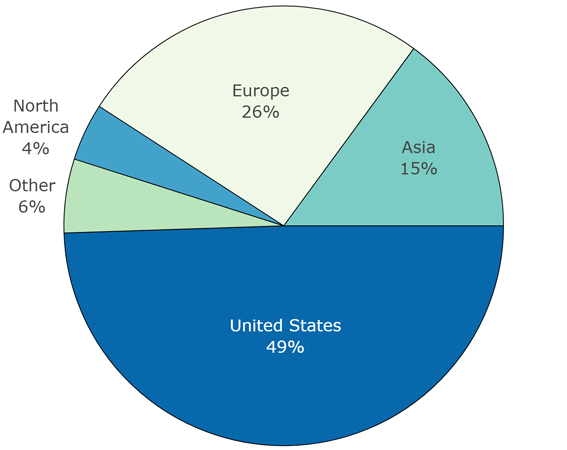

```{r,eval=knitr::is_latex_output(),echo=FALSE,results='asis'}
cat("\\FloatBarrier\\newpage")
```

## Appendix  {-}

### Appendix A {-}

#### Summary Information of the PCRI Private Capital Database {-}

The following tables and figures, from @jeng2015, provide a summary overview of the data collected on private capital firms, funds, and portfolio companies. In particular, the PCRI focuses on buyouts, growth equity, and venture capital investing.

```{r pcrifigurea1, echo=FALSE, out.width='100%', fig.cap='Number of Private Capital Firms by Year Founded',eval=knitr::is_html_output() }
knitr::include_graphics('./assets/pcri/pcrifigurea1web.png')
```
```{r pcrifigurea1-tex,echo=FALSE,results='asis'}
if ( knitr::is_latex_output() ) {
cat("\\input{./figures/pcrifigurea1.tex}")
}
```


```{r pcritablea1,echo=FALSE,results='asis'}
if ( knitr::is_html_output() ) {
pcritablea1.csv %>%
   kable(format.args = list(big.mark = ","),
         caption="Private Capital Firms by Location of Company Headquarters and Year Founded") %>%
   kable_styling(full_width = F)  %>%
    footnote(general="Source: @jeng2015.",footnote_as_chunk = T)
}

if ( knitr::is_latex_output() ) {
cat("\\input{./tables/pcri/pcritablea1.tex}")
}
```

```{r pcritablea2,echo=FALSE,results='asis'}
if ( knitr::is_html_output() ) {
pcritablea2.csv %>%
   kable(format.args = list(big.mark = ","),
         caption="Funds by Investment Type and Vintage Year") %>%
   kable_styling(full_width = F)  %>%
    footnote(general="Source: @jeng2015.",footnote_as_chunk = T)
}

if ( knitr::is_latex_output() ) {
cat("\\input{./tables/pcri/pcritablea2.tex}")
}
```


```{r pcrifigurea2, echo=FALSE, out.width='100%',fig.cap='Funds by Region (%)',eval=knitr::is_html_output() }

```
```{r pcrifigurea2-tex,echo=FALSE,results='asis'}
if ( knitr::is_latex_output() ) {
cat("\\input{./figures/pcrifigurea2.tex}")
}
```


```{r pcrifigurea3, echo=FALSE, out.width='100%', fig.cap='Funds by Industry (%)',eval=knitr::is_html_output() }
knitr::include_graphics('./assets/pcri/pcrifigurea3web.png')
```

```{r pcrifigurea3-tex,echo=FALSE,results='asis'}
if ( knitr::is_latex_output() ) {
cat("\\input{./figures/pcrifigurea3.tex}")
}
```

```{r pcritablea3,echo=FALSE,results='asis'}
if ( knitr::is_html_output() ) {
pcritablea3.csv %>%
   kable(format.args = list(big.mark = ","),
         caption="Portfolio Companies by Region and Year Founded") %>%
   kable_styling(full_width = F)  %>%
    footnote(general="Source: @jeng2015.",footnote_as_chunk = T)
}

if ( knitr::is_latex_output() ) {
cat("\\input{./tables/pcri/pcritablea3.tex}")
}
```

```{r,eval=knitr::is_latex_output(),echo=FALSE,results='asis'}
cat("\\FloatBarrier\\newpage")
```


```{r appendixb,child="./assets/pcri/pcri_appendixb_online.md",eval=knitr::is_html_output()}
```

```{r appendixc,child="./assets/pcri/pcri_appendixc_list.md",eval=knitr::is_html_output()}
```