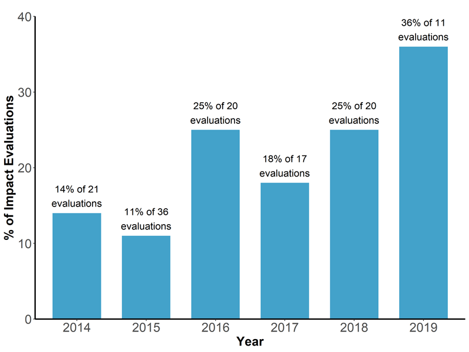
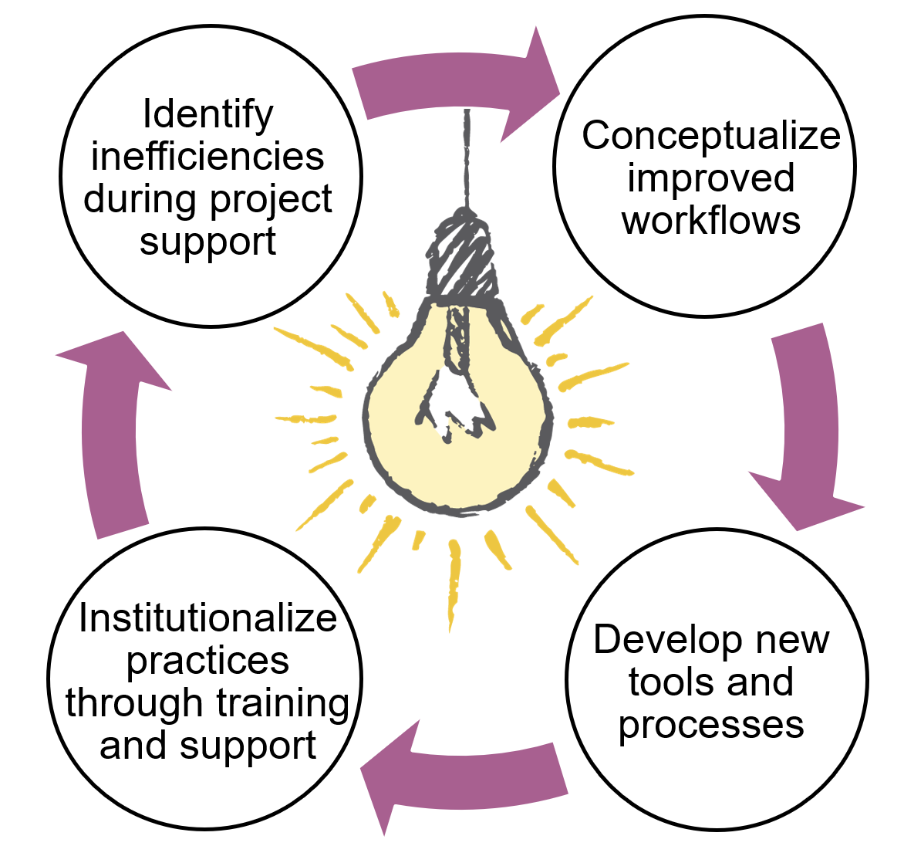

# Administrative Data in Research at the World Bank: The Case of Development Impact Evaluation (DIME) {#dime}

```{r, echo=FALSE, results='asis'}
printauthor("dime")
```

## Summary 

+DIME| evaluates impact. Evaluating impact is a good organizing principle for constituting high-quality data sets. It helps researchers structure the content and characteristics of data sets to enable policy analysis. This is not the case for administrative data, which are designed to monitor processes. The vector of variables and the selection of observations into administrative data can restrict its use for analysis. Low research capacity in government agencies further limits the use of administrative data even for its intended purpose. This chapter describes how the +Development_Impact_Evaluation| [DIME](https://www.worldbank.org/en/research/dime) department of the World Bank combines an evaluative and capacity-building approach to secure access to existing administrative data, then fuses it and integrates it with other existing or newly collected data, to make administrative data analysis-ready and provide added value to country clients.

As a global research program, +DIME| provides tailored +impact_evaluation| services to governments. Each set of services support governments in conceptualizing policies and programs, developing data plans, conducting +field_experiments| to guide mid-course corrections, and evaluating the impact of policy interventions in the medium to longer term. With about 200 long-term collaborations with government agencies across sixty countries, DIME works with governments to develop the data infrastructure and know-how to improve the evidence-base for public policy over time. In partnership with about thirty multilateral and bilateral organizations, DIME also invests in transforming the way development finance is used.

+DIME| uses administrative data across its thematic programs: economic transformation, public sector governance, infrastructure and climate change, fragility and conflict, and gender. Among these, administrative data features most prominently in public sector governance programs. This is because the recent investments countries have made in their +e-government| systems are generating a massive amount of transaction-level data. DIME's multi-country justice program, +Data_and_Evidence_for_Justice_Reform| ([DE JURE](http://pubdocs.worldbank.org/en/923891592406548876/DE-JURE-Brief.pdf)), leverages investments in smart courts and associated data systems to increase the economies of scale of knowledge generation on the quality and efficiency of judicial proceedings. Similarly, +ieProcure| accesses data from e-procurement systems to study the economics of public procurement and ways to improve the quality-to-cost ratio of procured goods and services. These programs develop analytical tools that can be adapted to different country contexts with the aim to support a tailored experimental research agenda in each context.

In country programs, +DIME|'s use of administrative data leverages economies of scope and partnerships across agencies in different sectors. The researchers develop spatially integrated, cross-sector data infrastructure and research to help optimize government economic policy, planning, and evaluation functions. The administrative data included in these data sets can include data from land registries, road networks, infrastructure investments, tax, energy billing, or social transfers. Administrative data are complemented with an array of other data sources---+survey|, census, remote sensing, and crowdsourcing---to create multi-sector, georeferenced data sets, maps, and dashboards that are tailored to each specific country context and policy interest. These data sets can be augmented over time to respond to new and evolving economic analysis needs. The [Rwanda  case](http://pubdocs.worldbank.org/en/703511592406882534/Rwanda-Program-Brief.pdf) is described below.

When an administrative data system does not exist or is not yet in digital format, +DIME| invests in piloting digital systems that can later be scaled up by government. The first experience working with the justice sector, for example, was in the context of the Dakar courts in Senegal where the research team digitized massive quantities of paper records to identify bottlenecks in the legal chain and measure the impacts of a legal reform on procedural efficiency. The patient safety and road safety +impact_evaluations| in Kenya provide examples of digital pilots.

This chapter will describe how +DIME| generates demand from government agencies and supplies them with research services that augment their data, program management, and policy functions. It presents examples from the +DIME| portfolio that demonstrate a spectrum of administrative data usage. It ranges from developing a pilot administrative data system, to digitizing paper-based administrative data, to leveraging existing cross-sector administrative data to develop a country data set, and to developing sector-specific data sets across multiple countries. In all cases, the aim is to establish capabilities for +impact_evaluation| analysis and investing in data as a public good to enable greater speed and frequency of policy experimentation and knowledge generation. These capabilities include long-term client relationships and local capacities that put knowledge into action.

## Introduction

### Motivation and Background

The experience in +DIME| shows that the issue of *access* to administrative data is not easily decoupled from the larger objective of creating capabilities for administrative data generation and use. The examples in this chapter demonstrate the role that research can play in developing better data systems---systems that are designed to support research on important policy questions---thus increasing their value for policymaking. The role of research in shaping data, or the fact that data are both research outputs and inputs, is not always well understood. Most efforts to collect data are driven by statistical agencies, not by research institutions, and statistics-driven data are on average a suboptimal input into research. To optimize data sets as an input into research, the data output itself should be research driven. When planning to evaluate the impact of a policy intervention, +DIME| researchers develop data sets based on a specified +measurement_framework|. The data sets include the vector of variables and variable characteristics that are aligned to the theory of change of the policy intervention and that have the sample size, power, representativeness, and coverage required to conduct the analysis. The source for each variable might vary. Sometimes more than one source is viable. When more than one source can be used for the same variable, comparisons can inform the understanding of data quality and the tradeoff between costs and quality. The resulting data set might fuse administrative data with survey, census, remote sensing, or crowdsourced data. This output is then an input to data analysis and research products. The novel data sets are analyzed to understand the economic problem the research team is trying to solve, develop testable hypotheses, and test them by implementing +field_experiments| designed to narrow down the causal pathways of programs and policies.

In no small part, DIME engagements seek to build administrative data systems that create research-quality data. Data integration increases value for research and policymaking and helps sustain longer-term efforts for data generation. While in the past, +impact_evaluations| relied heavily on baseline and follow-up surveys, today's data sets include spatially integrated data at various frequencies that are increasingly tailored to support a process of adaptive research and policymaking. As a result, the use of administrative data has increased in recent years, as shown in Figure \@ref(fig:dimefigure1), from about 15 percent of impact evaluations to more than 35 percent. And whereas administrative data in the past could be used mainly for A/B testing, integrated data sets can be used to assess biases in coverage and to evaluate policy impact.

```{r dimefigure1, echo=FALSE, out.width='100%', fig.cap='Use of administrative data at DIME'}
if ( knitr::is_html_output() ) {

}
if ( knitr::is_latex_output() ) {
    if ( ! file.exists('./figures/dimefigure1.png')) {
    file.copy('./assets/dime/dimefigure1.png','./figures/dimefigure1.png')
  }
  knitr::include_graphics('./figures/dimefigure1.png')
}
```

+DIME| secures access to administrative data and resources to collect supplementary data by generating demand for +impact_evaluations| from government agencies. Developing joint research agendas with government counterparts motivates government provision of administrative data. Adding value to governments in the form of data trainings, analytics, and tools secures continued access to the data and establishes open channels for policy discussions. Sharing analytical outputs early and often with the data provider is a critical step to sustainable data access. The administrative data analytics are often useful for increasing efficiency in government functions, and they help generate testable hypotheses (highlighted in the case of road safety in Nairobi below).

The +impact_evaluations| follow a co-production model in which the research team and the government counterparts work closely together on a shared agenda. The +DIME| model seeks to address constraints to data- and evidence-informed policymaking through multiple channels (illustrated in Figure \@ref(fig:dimefigure2)). This includes building skills to create informed consumers, using group dynamics to create cross-country communities of practice, subsidizing research services while counting on governments to finance data to address the public and private good elements of research, and addressing reputational and aspirational considerations by documenting successes and helping countries improve their abilities to save and improve lives.

```{r dimefigure2, echo=FALSE, out.width='100%', fig.cap='DIME model for adoption of data- and evidence-informed policy'}
if ( knitr::is_html_output() ) {
knitr::include_graphics('./assets/dime/dimefigure2web.png')
}
if ( knitr::is_latex_output() ) {
    if ( ! file.exists('./figures/dimefigure2.png')) {
    file.copy('./assets/dime/dimefigure2.png','./figures/dimefigure2.png')
  }
  knitr::include_graphics('./figures/dimefigure2.png')
}

```

### Data Use Examples 

+DIME|'s data sets and tools are tailored to the needs and requirements of evaluating the impact of a specific set of policy interventions. The data sets can be loosely categorized as project, spatial (country or city), or sector data, recognizing that each investment in data starts small and grows over time, sometimes cutting across these categories. For example, household survey data collected in Afghanistan for the +impact_evaluation| of the Targeting the Ultra-Poor (project) is now being used to ground truth algorithms that use telecom-provider data to identify the ultra-poor in Afghanistan (spatial) and develop data tools that can potentially be applied by social protection agencies in different countries to administer their social protection programs (sector) [see @aiken2020].

The administrative data component of these data sets come from government systems. In reality, only some of these systems are digital: some are paper-based and others simply do not exist. +DIME|'s work adapts to these conditions by either using existing data, digitizing paper-based reports, or developing data system pilots. In the justice example, DIME leverages investments in e-courts that were financed by World Bank projects. Where these investments have not been made, as in the case of patient safety in Kenya, a patient safety e-checklist and facility monitoring system were developed from the ground up. The chapter presents these and some other examples to highlight where DIME (1) developed a pilot administrative data system where none existed; (2) digitized paper-based administrative data to fill data gaps; (3) leveraged existing administrative data to develop a spatially integrated country data set; and (4) used recent investments in +e-government| to develop unique sector-specific data sets.

#### Piloting New Administrative Data Systems and the Case of Patient Safety in Kenya

With no systematic data available on compliance with patient safety standards in Kenyan health facilities, lack of clear rules of the game, and inadequate monitoring or enforcement of regulation, the +DIME| research team worked on developing an understanding of patient safety and experimentally tested a new inspection regime. In a partnership with the Kenyan Ministry of Health, the +Kenya_Patient_Safety_Impact_Evaluation| (KePSIE) piloted a high-stakes health inspection system for private and public facilities [see @bedoyaforthcoming]. It consisted of a new regulatory framework with clear rules of the game, a scoring system, and enforcement of warnings and sanctions where facilities were provided time to improve or face the risk of closure. To test such an intervention, an associated electronic inspection and monitoring system was created. To give some context, systems to report and diagnose constraints to patient safety are underdeveloped, even in high-income countries (see @wachter2010 and @longo2005), and of 45 countries in the Africa region with legislated quality inspection, only five actually implement any type of inspections, and those are mostly for private health facilities [@spreng2011]. The KePSIE's system was piloted and evaluated in three counties of Kenya representing 7 million health visits per year and a population of 4.5 million people. The 273 health markets, covering all facilities, were randomly assigned to one of three groups: (1) high-stakes inspections; (2) high-stakes inspections plus scorecards disclosing the score of the facility; and (3) control. The trial demonstrated that a new inspections regime that includes clear rules, monitoring, and enforcement is effective at improving patient safety in both public and private facilities (15 percent higher patient safety scores in treated relative to control facilities). The government is scaling up the inspection system at the national level with the support of a new World Bank Group (WBG) health operation. This case is a proof of concept of the value of supporting governments in developing data systems to evaluate sector-wide improvements in accountability and governance, especially when guided by researchers who invest in understanding issues such as, in this case, the role of national policies on safe healthcare practices and how data systems can support corresponding monitoring and enforcement systems [@worldhealthorganizationregionalofficeforafrica2014].

This work produced more than twenty operational outputs, three published papers, two forthcoming reports, five briefs and blogs, and ten dissemination events. The operational outputs include technical support to develop the new regulations, operational guidelines, trainings of health inspectors, training materials and manuals, and detailed inspection protocols. This example demonstrates the value that a research team can bring to the development of a monitoring system that is well integrated with effective regulation and a system of warnings and sanctions.

#### Digitizing Administrative Data to Fill Data Gaps and the Case of Road Safety in Kenya

Many countries face unsurmountable barriers to prioritizing their investments to reach their Sustainable Development Goals (SDG). This is even more difficult in areas with severe data limitations, such as the SDG target on halving mortality on the roads. The WHO estimates that only around 22 percent of road accident fatalities are captured in official records. To learn how to close this data gap, +DIME| invested in piloting high-frequency data systems for cities as part of its thirty country ieConnect for Impact program in transport. Generating data on crash locations and characteristics can help cities prioritize investments to reduce car crashes, road injuries, and deaths.

Kenya ranks among the top countries with road traffic deaths per capita in the world. Working in Nairobi, +DIME| undertook a massive effort to collate multiple different data sources to tackle this challenge. The researchers obtained administrative data through a data sharing agreement with the National Police Service (NPS). The NPS provided access to paper records stored in police stations across the city. A total of 12,546 crash records were manually digitized for a nine-year period across the city of Nairobi. The reports include crash details, location, and severity; these were then mapped to show crash hot spots. A preliminary finding showed that 98 percent of these reports included injuries or deaths, indicating that crashes without injuries or deaths had not been reported or stored. To supplement these records, the team then used crowdsourced crash data processed through machine learning algorithms to identify and geolocate crashes reported by an established platform on Twitter feeds [@milusheva2020]. To ground truth the crashes reported on Twitter, an app-based delivery firm was contracted to dispatch motorcycle drivers to the crash location within minutes after the crash was reported. The researchers also integrated private sector data on speed, road events, weather conditions, and land use from AccuWeather, Google Maps, Uber, and Waze. Data from Uber and Waze were accessed through a combination of publicly available data and specific partnerships leveraging the World Bank +Development_Data_Partnership| (DDP) initiative. The administrative data was combined with primary +survey_data| collected at 200 hot spots to ascertain infrastructure conditions and video analytics were used to ascertain road user behavior, which generated in excess of 100 new variables on high-risk locations.

Integrating all these sources into one data set provides unique insights into the contributing factors leading to a high concentration of crashes in specific locations. The analysis helped turn a seemingly intractable problem into something more manageable. For instance, it is now clear that 200 of the 1,400 crash sites across the city account for over half of road traffic deaths. This represents 150 kilometers of the 6,200-kilometer road network that can now be targeted for road safety interventions. The data creates an opportunity to design a randomized control trial to demonstrate how to prioritize scarce infrastructure and enforcement resources for high-risk locations and times to achieve the SDG on road safety, and is informing the road safety component of a large development project in Kenya +DIME| is exploring applications of the lessons from this project in Liberia, Mozambique, and Sierra Leone.

#### Leveraging Country Investments in Administrative Data Systems and the Case of Spatially Integrated Country Data Systems in Rwanda

Governments often lack the capacity to extract relevant sectoral information from their administrative data or to integrate data across sectors to conduct economic analysis. Country programs, a recent innovation for +DIME| that is currently being piloted in various countries, build deep country-level data ecosystems. These leverage a combination of administrative data and primary data collection to support a government strategy across one or multiple sectors of the economy. The more advanced case is that of Rwanda where DIME has worked for the last eight years. What started as a research collaboration with the Ministry of Agriculture and Animal Resources (MINAGRI) exploring multiple constraints to the adoption of production technologies in agriculture (see @jones2018, @jones2019) grew across multiple government agencies, including the Ministry of Infrastructure and the Rwanda Revenue Authority.

The Rwandan Feeder Roads Impact Evaluation is a canonical example of how +survey| and administrative sources of data can be brought together in a country program to answer questions beyond the scope of traditional +impact_evaluations|. This impact evaluation began as a partnership with the government to evaluate the impact of the national feeder road rehabilitation program across multiple donor investments and involved significant effort by the research and operational teams to coordinate across projects. In this spirit, a similar collaboration was launched with the government to harmonize the market price survey data. Data collected in rural markets in the catchment of targeted feeder roads were combined with the administrative e-Soko price data, collected at major markets nationally. The market locations are integrated into a geographical information system including maps of the road network and village boundaries. This enables the evaluation of the impacts of feeder road rehabilitation, and of national road construction more broadly, with all data sources in a harmonized platform.

A key component of country programs is leveraging this assembled data infrastructure to both increase client capacity for analytics and impact evaluation and to inform policy decisions in real time. To these ends, the team developed open-source dashboards to facilitate access to the data and support data analytics. The team also trained government officials in the development and use of these dashboards in a continuing effort to strengthen their monitoring and evaluation function. In addition, the country-level data system informs policymakers on the impacts of policies at-scale and helps operational partners coordinate evidence-based policy actions. In a recent example, the data ecosystem has informed MINAGRI on the impacts of the COVID-19 pandemic on food prices, which is guiding the optimal targeting of social protection response to the crisis.

#### Leveraging Investments in Government Systems and the Case of Data and Evidence for Justice Reform (DE JURE)

Governments that have invested resources in +e-government|, sometimes with World Bank support, are now demanding the analytics and research services that help them reap benefits from their investments. +DIME| works with procurement agencies and judiciaries, for example, to analyze e-procurement and e-justice data to improve the functional quality and efficiency; research is used in combination with tax data and firm +surveys| to understand important economic questions such as the demand effect of public procurement on firm growth or the effect of judicial efficiency on firm valuation. Investments in +e-government| have transformed the opportunities for analysis of the functioning of government. DIME is working with public administrations from low- to higher-income countries to analyze transaction level data on procurement, civil service, tax, customs, and courts proceedings to inform reforms aimed at increasing efficiency and quality of services.

One example is +DIME's| +DE_JURE| program. DE JURE aims to develop a global data infrastructure for the justice sector, expand artificial intelligence (AI) tools to produce interpretable data from unstructured text, and produce experimental evidence to inform justice reforms [@ash2018]. Large-scale data sets of all court proceedings and machine learning tools are being used to address whether judicial rulings betray systematic biases, arbitrariness, or inefficiencies in the administration of justice*.* Working in a diverse group of countries including Bangladesh, Brazil, Chile, Croatia, Estonia, India, Kenya, Pakistan, Peru, and Senegal, the program aims at increasing the amount and depth of the empirical research in justice, which has historically been limited by the lack of administrative data systems and tools to analyze massive amounts of transcripts [see @kondylis2019].

The value of justice sector administrative data is expanded when it is merged with other sources: human resources data to obtain the characteristics of court administrators; +surveys| of court administrators and users, run by the judiciary annually, to record perceptions and satisfaction; and firm-level data linked to the court data through firm's tax identifiers. In Africa and Latin America, +DIME| is collaborating with two judiciaries on three RCTs that leverage existing technological platforms to improve judicial performance and reduce court congestion. The first two evaluate what kinds of low-cost, actionable information reduce judicial delays. These RCTs test mechanisms for a better way to onboard AI [see @babic2020]. The third evaluates whether a telework program with congestion pricing using non-financial incentives might reduce court backlog. The team is also working on a project that evaluates how justice impacts economic outcomes. Leveraging the random assignment of cases to tribunals, the research team is evaluating the impact of differences in judicial speed on the outcomes of firms and their employees in two countries in Latin America and Eastern Europe. This builds off a machine learning methodology for causal inference developed in the judicial context [see @babic2020]. In Latin America, the current focus is an RCT of training judges amid a pedagogical transition from theory to case-based teaching (possibly based on the history of their past decisions) and includes self-reflection exercises (which embeds social-emotional learning interventions). Prior analysis of economics training of US judges found the training shifted the direction of legal precedent by 10 percent [@galletta2019]. The team is also launching RCTs of legal analytics for firms, addressing questions such as whether information that facilitates investment decisions lead to legal innovation [@chen2015]. In South Asia, DIME measures textual slant in the manner in how judges from different castes describe litigants from the same or another caste (see @ash2019). The team also uses gender-based violence prevention reported through mobile applications to assess missing cases. In Eastern Europe, the team studies when judicial decisions can be successfully automated. The +DE_JURE| initiative is exploring how, collectively, these insights can spur e-justice solutions.

## Making Data Usable for Research

There are many challenges to making administrative data usable, and these challenges are similar across many different contexts in which +DIME| works. Often administrative data are available in hard copy only; data sets are not interoperable due to inconsistent or omitted numeric identifiers; data generation is decentralized and there is no aggregation at the national level; and administrative data coverage is limited or biased. As a result, integrating data requires multiple trips to field offices, coding and digitization, painstaking efforts to merge on available variables, and careful validation with other data sources. Cases from DIME's portfolio illustrate some of these problems:

*The data are available in hard copy only.* In Senegal and Kenya, the court records were originally in paper version only, and the +DIME| research team invested more than one year in coding and digitizing several years-worth of case records. Initially, it was difficult to estimate the time required to digitize the data, which injected some uncertainty in the +impact_evaluation| process. Also, this work required a substantial amount of resources, including involvement of DIME researchers and consultants and the judiciaries' central and local staff. In practice, this type of task falls on the research team. It was not before analytical results were shared that the value of using this type of data was appreciated.

*There are data sets that are not interoperable*. In Chile and Croatia, access to the data was substantially easier as both countries' judiciaries have an advanced case management system, which generates vast amounts of granular data about each aspect of every case. As such, administrative data were shared with a smooth and fast process and only required standard data cleaning to make data usable for research. However, significant challenges arose when merging the court level data with firms' data and tax records. The administrative data systems at different institutions were not interoperable and merging the different types of data took significant time and effort. In +DIME|'s experience, the interaction between research and governments can demonstrate the utility of a common and consistent system of record identification and can spur governments to improve systems.

*There is decentralized data generation.* In Rwanda, as in most contexts, each line ministry generates their own administrative data with little knowledge of, or interaction with, data from other ministries. There is no centralized repository, so even learning what data sets are available requires a significant investment of time. Making the individual data sets useful for research required linking across ministries and incorporating detailed data from local government that are never centralized. Getting all different agencies to agree to share data requires building relationships with each agency and customizing outputs to meet the expectations of each one.

*There are data sets that are limited or biased in coverage.* In the case of Nairobi road traffic crashes, the comparison between administrative and crowdsourced data demonstrates that data from a specific source, whether administrative or crowdsourced, cannot be assumed to be representative of the underlying population. The police data was found to be limited to a specific subsample of the population (crashes with injuries or deaths) while crowdsourced data was found to be unequally distributed across time and location.

*There is a lack of administrative data systems*. Perhaps the most extreme challenge is a case where there is no system to record administrative data. In Kenya, the process for health inspectors checking compliance with patient safety lacked clear rules, and as there were no full-time inspectors, it only covered a small portion of the facilities each year. The +DIME| data pilot made it possible, to have a wide-reaching and comprehensive system that achieves the following: record detailed information of more than 300 items for all facilities in a standardized manner; generate scores and classify facilities by the end of the inspections to let the facilities know their performance; and provide facilities with warnings, sanctions, and next steps. This facilitated the government's capacity to monitor and enforce safety standards by improving inspection regulation, monitoring standards, and enforcement in the pilot regions. The policy insights generated from the work convinced the government of the utility of scaling up the inspection system nationally (financed by a World Bank project).

Even when pilots are demonstrated to be effective, the institutionalization of new data systems by government might fail due to either resource constraints or the lack of capacity for successful operation. In these cases, the gains from using data effectively are short-lived. As opposed to health in Kenya, the courts in Senegal did not continue digitizing records or transition to electronic case management. As a result, data-driven management of the court was imperiled. As the Kenya example shows, development finance must supplement the work of +DIME| to build and scale up systems. While researchers can make explicit the value of data and data systems, the effort required for fully adopting effective data systems in government are beyond the scope of limited research funding and capacities. It thus falls on governments to use their own resources or demand support from development institutions to build these systems.

## Legal and Institutional Framework 

### Institutional Setup

+DIME| has a global portfolio of 123 active +impact_evaluations|. The portfolio is supported by a team of twenty research economists, twenty other permanent staff, and co-authors from academic institutions. The portfolio generates correspondingly large amounts of data with more than 300 +surveys| completed over the past six years and many projects relying on high-frequency data, satellite data, and administrative data.

Standardizing and enforcing protocols for high-quality research across such a large portfolio and team is challenging. +DIME| chose to address this by investing in +DIME_Analytics| as an institutional, portfolio-wide solution. DIME Analytics is a centralized unit responsible for developing and ensuring adoption of best practices in data collection and analysis across DIME's portfolio. In DIME's experience, centralizing resources and reducing the private costs of adopting reproducible research practices is key to ensuring high-quality, reproducible research. DIME Analytics identifies inefficiencies and practices that compromise research quality, develops improved workflows, creates and tests tools needed for their adoption, and then provides the training and technical support necessary to sustain adoption (illustrated in Figure \@ref(fig:dimefigure3)).

```{r dimefigure3, echo=FALSE, out.width='100%', fig.cap='DIME Analytics uses an iterative process to expand technical capacity throughout the research cycle'}
if ( knitr::is_html_output() ) {
knitr::include_graphics('./assets/dime/dimefigure3web.png')
}
if ( knitr::is_latex_output() ) {
    if ( ! file.exists('./figures/dimefigure3.png')) {
    file.copy('./assets/dime/dimefigure3.png','./figures/dimefigure3.png')
  }
  
}

```

+DIME_Analytics| ensures the credibility of +DIME| research by developing best practices, providing implementation tools and workflows, and monitoring compliance across all research teams. Research assistants (RAs) follow a formal annual training program designed to teach recent graduates the skills they need for a future in research. The program includes ten full-day courses, twelve seminar-style continuing education courses, and customized academic development through office hours. The training program covers standard data structures, safe and reproducible data practices, data collection and cleaning workflows, and the tools created by +DIME_Analytics| to implement these standardized practices. Institutionalizing RA recruitment and training means that researchers spend less time onboarding staff and that technical skills are standardized across the portfolio, so research assistants can more easily be assigned to different tasks across an +impact_evaluation| portfolio without significant retraining. The approach facilitates portfolio-level improvements to reproducible research. For example, when RAs follow consistent coding conventions, reviewing code is more efficient. The training program provides a mechanism to address problems and inefficiencies identified by DIME Analytics and to disseminate newly developed tools and workflows. In 2019 alone, DIME Analytics offered 28 reproducible research trainings.

In addition to the standardized training program, +DIME_Analytics| offers regular *bootcamps* to achieve real-time technology adoption. These hands-on sessions directly transition projects to improved workflows. A recent bootcamp focused on safe handling of confidential data for all active projects. Participating project teams implemented updated data security protocols to achieve full adoption across the +DIME| portfolio by the end of the bootcamp session. An earlier bootcamp transitioned all research teams to reproducible workflows, such as using git/GitHub to manage and version-control all analytical code for DIME projects.

By investing in +DIME_Analytics|, +DIME| aims to improve both its own portfolio and the quality of development research more broadly. All the resources developed by DIME Analytics are shared publicly through the [DIME Wiki](https://dimewiki.worldbank.org/), [Development Research in Practice: The DIME Analytics Data Handbook](https://worldbank.github.io/dime-data-handbook/), and the annual [Manage Successful Impact Evaluations course](https://www.worldbank.org/en/events/2019/06/10/manage-successful-impact-evaluations). There are few other development research institutions that develop and publicly share research protocols and trainings. DIME adheres to this unusual standard of transparency so that the practices are continuously improved through public scrutiny and feedback and so that high-quality research tools and practices are globally available and accessible. There is significant demand for such public goods: Figure \@ref(fig:dimefigure4) shows the global reach of the DIME Wiki, which has attracted more than 128,000 global users since it was established in 2018.

```{r dimefigure4, echo=FALSE, out.width='100%', fig.cap='Global DIME Wiki usership'}
if ( knitr::is_html_output() ) {
knitr::include_graphics('./assets/dime/dimefigure4web.png')
}
if ( knitr::is_latex_output() ) {
    if ( ! file.exists('./figures/dimefigure4.png')) {
    file.copy('./assets/dime/dimefigure4.png','./figures/dimefigure4.png')
  }
  knitr::include_graphics('./figures/dimefigure4.png')
}

```

### Legal Context for Data Use

+DIME| has historically relied on informal data sharing agreements based on relationships with government counterparts and clearly established, shared objectives. However, the process is becoming more formalized. In 2018, the World Bank issued a procedure for Development Data set Acquisition, Archiving and Dissemination,[^dime1] which provides staff with specific guidance and a template +data_license_agreement|.[^dime2] The template data license agreement specifies the specific objectives of the data sharing and whether the data can be used only for the established purpose or for other objectives consistent with the mandates of the signatory organizations. It establishes the terms of the agreement and the type of data access protocols. Protocol options include open data, licensed use, official use only (access limited to World Bank staff), access restricted to pre-authorized WB staff, access restricted to pre-authorized WB staff working on a specified project or a specified output, or access restricted to a specific business unit or individuals. The data provider may impose restrictions to sharing derivative works and any or all of the metadata. The agreement also specifies the required citation for the data. As this template is pre-approved by the World Bank's legal team, and thus fast-tracks the data sharing process, most partners agree to use it.

+DIME| researchers also often negotiate with the private sector for access to proprietary data, typically with a letter of support from the government. The World Bank has negotiated +data_license_agreements| with global companies with data of broad interest for development research, through the [Development Data Partnership (DDP)](https://datapartnership.org/). Current partners include Digital Globe, the European Space Agency, Facebook, Google, LinkedIn, Uber, and Waze. Under the terms of the standard +DDP| license agreement, data sets are provided for the World Bank's use for any objective consistent with the World Bank's mandate.

World Bank governance does not compromise +DIME| independence in its research. +Impact_evaluation| reports are reviewed through a World Bank process, but research papers do not require World Bank or governments' clearance. They are published with authors' disclaimers and are not considered official documents of the World Bank.

### Legal Framework for Granting Data Access

As per the World Bank Procedure on Development Data Acquisition, all development data sets acquired by the World Bank are to be deposited in the internal Development Data Hub and classified as either public or restricted access. Deposit is to be made no later than six months after the data are acquired with the provision to later deposit any revisions or updates. Once deposited, staff may choose to embargo dissemination pending the publication or release of any derivative work(s). Staff are encouraged to provide data in an open format and public license to facilitate re-use.

Data archival is a requirement for funding under the [Impact Evaluation to Development Impact (i2i) Trust Fund](https://www.worldbank.org/en/research/dime/brief/i2i-fund). To qualify for +i2i| funding, data must be cataloged in the year in which it was collected. Typically, that data are embargoed (i.e., cataloged but not released) until publication of the research results. In some cases, teams release data prior to publication but embargo the variables identifying the random assignment or non-experimental design. These embargoes apply both internally and externally. The expectations around the timeline for data publication were established with low-frequency +survey_data|; there are not yet clear policies in place governing the publication of high-frequency data.

+DIME| publishes all data that can be made publicly available, as per the terms of the agreement with the data provider, to the [World Bank's Microdata Catalog](https://microdata.worldbank.org/index.php/home). On the Microdata Catalog, staff choose the [terms of use](https://microdata.worldbank.org/index.php/terms-of-use). Options include open access; direct access (data are freely available under basic conditions); public access (data are available to registered users who consent to respect a list of core conditions); or licensed files (users request data access for a specific purpose directly from the data owner). DIME data sets are typically catalogued as licensed files. To access licensed files, interested individuals must disclose the intended use of the data and a list of expected outputs, and no other uses are permitted without prior written consent from the World Bank.

Much of the administrative data used by +DIME| are classified as restricted access, as per the terms of the license agreements, and cannot be made publicly accessible. Restricted access data are classified into three tiers of internal access: data classified as *strictly confidential* are accessible only to specific individuals; data classified as *confidential* are accessible on a need-to-know basis; data classified as *official use only* are accessible to all staff in the institution. DIME often shares (de-identified) data on a need-to-know basis with operational colleagues, such as questions around placement or targeting of new World Bank operations. As there is no publication incentive in this case, issues of intellectual property are less salient. In cases where the data cannot be published publicly, publishing the research is a way to demonstrate to researchers that the data exist (and the types of linkages are possible). DIME also aims to incentivize policymakers to increase their use of that data and their willingness to collaborate with other research teams.

## Protection of Sensitive and Personal Data: The Five Safes Framework

### Safe Projects

Creating a safe project involves a collaboratively developed research agenda that serves each entity involved in the project and a shared understanding of how data will be used. This is core to +DIME|'s co-production model. The researchers, government, and any implementing partners start from a problem in which they are all invested and work together toward a solution, rather than pursuing a research question pre-determined by the researchers.

To evaluate the appropriateness of potential projects, +DIME| considers three factors:

(1) Does the research collaboration contribute to the public good, and is it policy-relevant?
(2) Is the approach technically valid?
(3) Is the proposed approach transparent and ethically sound?

+DIME| projects are governed by the +i2i| trust fund. Proposed projects are evaluated through an external double-blind review process at both the *expression of interest* and the full *concept note* stage. The review assesses the policy contribution and the technical merits and flags potential ethical issues.

To assess policy relevance, proposed +i2i| projects are scored by World Bank operational departments at both the *expression of interest* and the *concept note* stage. They evaluate proposed projects on their potential to contribute to evidence gaps, potential to influence the design and/or scale-up, and potential to influence prioritization of current and future development interventions. +Impact_evaluation| *concept notes* go through a formal World Bank approval process, which concludes with a review chaired by either the country manager or the practice manager and two external reviewers (usually a subject-matter expert and an operations expert). This ensures ongoing relevance of +DIME|'s work to World Bank and country policy priorities.

To evaluate technical merit, all proposed +i2i| projects go through a double-blind review by external academics. Final decisions are made by a technical committee comprised of experienced research economists from the World Bank. The review process is a meaningful mechanism for selecting appropriate projects and cuts off a substantial portion of the distribution. This is demonstrated in Figure \@ref(fig:dimefigure5) (technical ratings are given on a scale of 0 to 3 with 3 being highest quality). From the first seven open calls, just over 50 percent of proposals were accepted as i2i projects.

```{r dimefigure5, echo=FALSE, out.width='100%', fig.cap='Distribution of technical ratings of impact evaluation proposals'}
if ( knitr::is_html_output() ) {
knitr::include_graphics('./assets/dime/Figure5-mod.png')
}
if ( knitr::is_latex_output() ) {
    if ( ! file.exists('./figures/Figure5-mod.eps')) {
    file.copy('./assets/dime/Figure5-mod.eps','./figures/Figure5-mod.eps')
  }
  knitr::include_graphics('./figures/Figure5-mod.eps')
}

```

To evaluate ethical soundness, the technical review flags projects with potential ethical issues; these projects must go through Institutional Review Board (IRB) approval and any issues must be addressed by the researchers before funding is released. +i2i| promotes registration of all +impact_evaluation| studies. Currently, 42 percent of +DIME| studies are registered, which is a figure that is increasing over time. Additionally, the *concept note* template requires detailed explanation of data acquisition strategies and data quality controls. Once projects are underway, research teams must submit annual updates to MyIE, +DIME|'s internal monitoring system. This is a unique mechanism to validate compliance with +DIME| protocols, as research teams are required to document study registration, updates to research design, data sources and use, and policy influence.

### Safe People

The World Bank has well-established relationships with its member states and a reputation for high-quality analytical work. +DIME| researchers work on public good research, which fosters mutual trust and accountability to clients. Much data sharing occurs initially under the auspices of the larger relationship with the World Bank and is sustained through the ongoing collaboration. At +DIME|, researchers have a special ethical responsibility: to generate scientifically valid and credible research that is actionable. Upholding high research standards is secured through competitive selection of research economists on the academic market and high standards of competitive hiring for all other staff involved in the production of +impact_evaluation| products. For example, in +DIME|'s most recent recruitment for research assistants and field coordinators, the rigorous evaluation process (including objective evaluation of software skills) resulted in less than 5 percent of applicants being offered a position.

To maintain high ethical standards, in addition to the IRB process, all researchers working on i2i-funded projects are required to submit documentation of successful completion of ethics training on conducting human subjects research from recognized providers such as [CITI](https://about.citiprogram.org/en/homepage/) or [PHRP](https://phrptraining.com/). Human subjects research certification is also required for any team member who is expected to work with personally identifiable data.

World Bank employment contracts govern intellectual property rights and specify that any works produced, or materials acquired, during the course of the appointment belong to the World Bank. As research assistants and field coordinators typically work with confidential data, +DIME| requires the signature of [non-disclosure agreements (NDA)](https://github.com/worldbank/dime-standards/blob/master/dime-research-standards/pillar-4-data-security/data-security-resources/dime-data-nda-mou.md) at the start of their tenure. The NDA has specific provisions for maintaining full confidentiality and safeguarding private information. As a condition of employment, personnel commit to keeping all research information confidential, to blind any identifying information, to handle all data securely, to use secure technologies for encryption-at-rest and encryption-in-transfer, and to destroy all local copies of data and research outputs at the end of the contract unless given written authorization by the research staff. New hires are also required to review +DIME|'s [Data Security Standards](https://github.com/worldbank/dime-standards/tree/master/dime-research-standards/pillar-4-data-security) and pass an assessment on the content.

### Safe Settings

+DIME| has recently formalized its Data Security Standards, which apply to all confidential data. Confidential data include all data that are categorized as restricted access, due to terms of license agreements or inclusion of personally identifying information. The Data Security Standards are intended to ensure that confidential data are accessible to only the specific research team members listed on the Institutional Review Board approval. World Bank computers are encrypted, and the enterprise version of OneDrive encrypts all data on the fly; however, since +DIME| works extensively with external partners, additional protocols have been self-imposed. These protocols include encryption-in-transit required for any data transferred over the Internet, encryption-at-rest required for data stored on any server (from data collection servers to longer-term storage options), and encryption-at-rest required for local folders used to store confidential data (whether shared or not). Larger data sets are stored in secure servers in the World Bank's cloud environment, with access limited to specified World Bank staff and consultants using World Bank--controlled credentials through a single sign-on process. The strong encryption protocols are necessary given frequent domestic and international travel by research team members, which necessitates the use of laptops and prevents a physical infrastructure solution.

Research assistants and field coordinators are trained in +DIME| Data Security Standards, and they in turn work closely with government counterparts and implementing partners to make sure that the standards are applied. Field coordinators play a particularly important role in identifying data security challenges and helping to implement secure protocols, as the field coordinators are physically present with partners. +DIME_Analytics| offers customized support to DIME project teams for setting up secure data infrastructure and provides advising on safe handling, transfer, and storage of confidential data.

In terms of safe data acquisition from external providers, data are typically uploaded from a provider to a WB OneDrive (enterprise) folder. Two-factor authentication with an on-demand, single-use code is sent by e-mail. The encryptions-in-transit protocol is HTTPS and data are encrypted-at-rest immediately on the WB-controlled OneDrive (enterprise) server. Larger data sets sent directly to a cloud environment are typically pulled into those environments using an SFTP protocol.

When digitizing administrative data, case-by-case protocols are developed to ensure data security. In the example of the Nairobi road safety evaluation, the team set the following protocols: paper records were scanned at the police department headquarters, so physical copies never left the premises; the records were scanned by a +DIME| field coordinator, who was subject by contract to standard provisions of data confidentiality and ownership; the field coordinator physically transferred the scans to the firm hired to digitize them; the contract for the firm included standard provisions requiring that the firm or any of its employees cannot use or disclose the information being digitized; and personally identifying variables were not digitized.

### Safe Data

The key to ensuring safe data is respecting privacy rights. In many cases, +DIME| accesses data that is confidential and therefore requires secure sharing protocols. Protocols for data security are detailed in the chapter on Data Acquisition in [Development Research in Practice: The DIME Analytics Data Handbook](https://worldbank.github.io/dime-data-handbook/). DIME encourages research teams to de-identify confidential data as early as possible in the process to reduce access restrictions. This simplifies workflows (i.e., avoids frequently handling encryption keys to access data) and limits risk of possible access breaches. This typically involves stripping identifiers not directly used in the analysis and keeping only encoded versions of constructed indicators. All variables tagged as potential identifiers are removed from data before publication, although this creates a trade-off in terms of data usability. Discussions are ongoing with the World Bank Data Group on possibly implementing more sophisticated disclosure protocols, such as differential privacy. Stripping spatial information, while important for maintaining privacy, decreases the value of the data, as it limits integration with other data sources.

The digitization of administrative data is done using vetted software platforms that offer secure encryption. Digitization is typically done by a consultant or firm that is contracted by the World Bank; contracts include clear stipulations of intellectual property and data ownership. When digitized, the data are submitted directly to servers hosted by the World Bank, rather than a third-party. +DIME| typically uses SurveyCTO for manual data digitization, because of the tools for safe data (e.g. tools to encrypt data, publish subsets of data, and limit access to sensitive data based on user profiles).

### Safe Outputs

The primary mechanism for ensuring safe outputs at +DIME| is rigorous protocols for assessing disclosure risk in analysis data sets. When outputs are generated from data sets that are rigorously de-identified, disclosure risks for outputs are minimized. In cases where analysis relies on identifying variables, more care is needed to mitigate disclosure risk. As a safeguard, one of the checks in DIME's pre-publication code review process is to check all outputs and tabulations for disclosure risk, particularly outputs concerning subsamples.

## Data Life Cycle and Replicability

### Preservation and Reproducibility of Researcher-Accessible Files

Version control and transparent workflows are critical to ensuring reproducibility. As discussed in an earlier section, +DIME| has instituted clear workflows to transparently document all modifications to data after initial receipt. DIME has recently established new reproducibility standards and implemented those through a hands-on *reproducibility bootcamp*. These standards include keeping all projects on GitHub or (version control more generally); establishing protocols for project documentation, data storage, and identifiable information management; and establishing protocols for the extent that sensitive data can be shared for replication and reanalysis. While most of these elements are common across types of data, secure storage solutions and access protocols for identifiable data are of greater concern with administrative data because of the size of the data and number of subjects.

Accessibility to a second user and long-term data engagements are potential benefits of administrative data. Documentation is critical to allow for continued usage; tracing and recording the process of gaining data access, developing data sets, and preparing data for research, and recording the relationship histories and the people involved in the project. Since relationships with data providers and individual researchers are often the point of first access, preservation of research projects involves knowing the story behind the data access. At this point, there is not a technical solution to facilitate this documentation, but the hope is to advance on this when infrastructure allows.

### Preservation and Reproducibility of Researcher-Generated Files

Prior to publication, all +DIME| research papers undergo a +computational_reproducibility| check completed by +DIME_Analytics|. This verifies that using the same materials and procedures provided in the paper, a third-party can exactly reproduce the tables and figures in the paper. DIME Analytics has developed a detailed checklist for this purpose, which is completed by the research team at submission, verified during the reproducibility check, and returned to the team for inclusion in an online appendix. The completed checklist clearly indicates the reproducible research standards with which the project complies. Adopting reproducible workflows from early in project implementation simplifies the final reproducibility check. All DIME working papers have computational reproducibility verified; DIME recently scaled up this service to be available to all World Bank staff.

Once reproducibility is verified, +DIME_Analytics| supports the project team in publishing the code and data for the project. All data that can be made public (per the terms of the +data_license_agreement|) are published to the World Bank Microdata Catalog. Code is typically published to the World Bank's GitHub site. Data that are *official use only*, or more restricted access, are archived on the internal data hub, which provides information on metadata and is accessible to World Bank staff. For the Microdata Catalog, documentation and cataloging are done in accordance with the Data Documentation Initiative (DDI) metadata standard---an international, XML-based standard for microdata documentation---and based on the guidelines for data archival described in the [Quick Reference Guide for Data Archivists](https://guide-for-data-archivists.readthedocs.io/en/latest/). It also complies with the XML Dublin Core Metadata Initiative (DCMI) Specifications for documenting external resources (questionnaires, reports, programs, etc.). Preservation also requires effective management of storage media. Stata is used as a standard internal format, and a policy on managing migration to later versions is under development by the Microdata Catalog team. The Microdata Catalog does not require a disposal protocol. Obsolescence of media is not thought to be a concern. DIME has no active disposal protocols at this time.

## Sustainability and Continued Success

### Outreach

A shared research agenda and continuous engagement over the lifetime of an +impact_evaluation| are key to DIME's outreach strategy to its clients. Generating timely descriptive outputs and creating accessible data interfaces builds trust and interest. This facilitates government counterparts' access to their own data and increases the relevance of partnerships with DIME to their day-to-day work. DIME does extensive capacity building activities, such as hands-on trainings in data management and descriptive analysis, to increase counterparts' direct engagement with the data. Training is a means to sustainably maintain engagement with the research question by building practical staff knowledge of the researcher-generated data outputs.

A typical +DIME| outreach strategy is as follows. First, the research team agrees on the research agenda with the client and maps the existing data landscape (as discussed above). Second, the research team integrates various data sources to create the data sets, which will ultimately be used to generate original research outputs. Third, where useful, DIME creates accessible, open-source interfaces for government counterparts to interact with administrative data sources, such as [Shiny](https://shiny.rstudio.com/) dashboards. Fourth, the research team engages with the data provider to generate new insights and ways for the data provider to understand how they can improve the use of their data and to build capacity for internal data-driven operational evaluations and program evaluation. The end goal is to demonstrate the utility of the data sets and to catalyze investments in institutionalized data systems with formal access protocols and well-developed data security infrastructure.

The data use examples illustrate DIME's outreach strategy:

In the *Rwanda* case, the feeder road evaluation is part of the research team's broader collaboration on +impact_evaluations| with the Government of Rwanda, which has been ongoing since 2012. Team members travel to Rwanda quarterly and regularly engage in high-level policy discussions. Results are presented to the minister as they become available. This ensures that research impact resonates at the highest level of government. +DIME| has invested in significant capacity building with counterparts at the Rwanda Transport Development Agency and the Ministry of Agriculture and Animal Resources by providing hands-on trainings on data management and analysis and providing frequent descriptive analytical outputs to help improve data collection systems and answer policy questions. The research team worked with the government to develop an open-source Shiny dashboard as an accessible way for government officials to engage with data. Dashboards are more of a data interaction than a data extraction, but they can preserve engagement with data and facilitate use of data for policy decisions that go beyond the original research agenda.

The *+KePSIE|* experience illustrates that the +DIME| co-production model with national counterparts can be sustained over a six-year period, overcome many delays and much turnover of key stakeholders and still secure substantial success. DIME strengthened the Ministry of Health's data systems by developing an electronic checklist to collect inspection records and by creating a pilot web-based monitoring and planning system that aggregates inspections results and allows for real-time access to patient safety monitoring and inspections implementation. The checklist and score system that DIME helped develop for the evaluation became the national regulatory health facility inspection system for both private and public facilities.

In the *+Nairobi_road_safety|* case, the +DIME| team established a broad collaboration with members of the Kenya Working Group on Transport that includes Kenyan ministries, departments, and agencies in the transport sector, as well as interested development partners and the National Police Service. Team members engaged in high-level policy discussions with this multi-stakeholder group and engaged in operational discussions with specific members to develop collaborations and pilot ideas such as an electronic-crash record system with the police.

The work with the *justice sector in Kenya* has included a collaboration with the highest levels of the judiciary to develop score cards, analyze data, and introduce reforms. After the digitization of court records was completed, the Judiciary of Kenya has started to use the judge-level data as part of their performance management process and to keep judges and other key court staff updated on key indicators, such as case backlog. Finally, insights from the data are informing the design of reform and testing of pilot interventions.

### Revenue

+DIME| +impact_evaluations| are financed through grants, including the +i2i| Trust Fund. Primary data collection is typically financed by World Bank operations. Data acquisition from government counterparts is typically shared on a no-fee basis through a +data_license_agreement|. Private sector data are either provided pro bono, in exchange for research services, or procured through research grants. Data made available through the +Development_Data_Partnership| incurs no usage fees for World Bank staff. For example, in the +Nairobi_road_safety| project, Uber and Waze data were made available at no cost through the DDP. Data that are financed through lending operations, such as the +e-government| interventions, are made available for the research team at no additional cost. For example, the +DE_JURE| projects make use of the large amounts of data generated by e-government investments in partnership with the World Bank operational teams.

### Metrics of Success 

A successful +DIME| +impact_evaluation| is one that improves counterpart data systems, influences policy decisions, and is fully reproducible.

#### What Clients Say About DIME {-}

To objectively measure success, +DIME| conducted a carefully designed survey for 44 engagements in 22 countries (106 respondents) [@legovini]. Analysis of the survey responses---from 33 implementing agencies as well as World Bank project managers, known as Task Team Leaders---suggests that the technical support provided throughout the design and implementation processes has had positive effects on data systems (e.g., monitoring and evaluation capacity) and policy design.

With regards to data systems the surveys showed positive feedback:

- 100 percent of respondents from implementing agencies and 93 percent of World Bank TTLs documented instances where +DIME| contributed to monitoring and evaluation capacity.
- 82 percent of respondents from implementing agencies and 94 percent of World Bank TTLs documented how the baseline analysis contributed to policy design.

In terms of policy influence the surveys showed the following results:

- 68 percent of respondents from implementing agencies and 79 percent of World Bank TTLs reported that a proven treatment intervention was adopted by the government.
- 62 percent of the respondents from implementing agencies and 13 percent of the World Bank TTLs reported the engagement motivated scale-up and/or scale-down of the government intervention.
- 71 percent of respondents from implementing agencies and 52 percent of World Bank TTLs reported that the engagement had a positive spillover effect on other projects as well.
- More broadly, 89 percent of respondents from implementing agencies and 85 percent of World Bank TTLs thought the engagement helped rationalize the design process of the relevant policy, and 94 percent of all respondents thought the engagement with +DIME| added value to their units.

#### Reproducible Data Projects {-}

Since 2018, +DIME| has required that all working papers pass a +computational_reproducibility| check before they are published; +DIME_Analytics| has to be able to reproduce the exact results from the paper using the data and code provided. Institutionalizing this requirement has led to big gains. In 2018, only 17 percent of working papers met the computational reproducibility standard and half of the papers required significant revisions to achieve it. In contrast with 2019, nearly two-thirds of DIME working papers met the reproducibility standard and less than ten percent required significant revisions. This increase reflects both significant efforts by DIME Analytics to identify reproducibility challenges and offer targeted trainings and tools as well as a significant mindset shift for research teams. Currently, DIME is well above the norm in the field. An analysis of 203 economics papers published in top journals in 2016 showed that less than one in seven provided all data and code needed to assess computational reproducibility [@galiani2017]. More recently, at the American Economic Review, only two out of five accepted papers passed the computational reproducibility check on first pass [@vilhuber2019].

```{r dimefigure6, echo=FALSE, out.width='100%', fig.cap='DIME computational reproducibility check results'}
if ( knitr::is_html_output() ) {
knitr::include_graphics('./assets/dime/dimefigure6web.png')
}
if ( knitr::is_latex_output() ) {
    if ( ! file.exists('./figures/dimefigure6.png')) {
    file.copy('./assets/dime/dimefigure6.png','./figures/dimefigure6.png')
  }
  knitr::include_graphics('./figures/dimefigure6.png')
}

```

## Concluding Remarks

+DIME| has worked with client countries for the past fifteen years to strengthen their capacity for evidence-informed policy decisions. The DIME model is to support governments throughout policy design and implementation processes and invest heavily in the production of research-led data sets that can be applied to understanding the economic problems governments are trying to address. By striking a delicate balance between generating high-quality evidence and remaining responsive to policy processes on the ground, DIME has been able to build trust relationships with government clients. By helping governments build capacity for data and evidence-intensive policymaking, DIME secured broad access to administrative data and the opportunity to improve its quality.

## About the Authors {-}

[Arianna Legovini](https://www.worldbank.org/en/about/people/a/arianna-legovini) heads the Development Impact Evaluation (DIME) Department of the World Bank. She established this group in 2009 based on a model of collaboration between research and operations to optimize project design, secure higher returns to development investments, and empower governments to generate contextually relevant evidence to guide their policymaking process. She successfully aligned US\$200 million in donor and government client financing to support a systematic approach to data analytics and causal evidence across a large program of World Bank and other development banks operations. She now presides over a team of 186 people conducting research in sixty countries across all sectors, working with 200 agencies, and shaping US\$20 billion in development finance. She started similar groups with the Inter-American Development Bank and the Africa region of the World Bank. She provides advisory services to the thirty largest multilateral and bilateral development agencies in the world.

[Maria Ruth Jones](https://www.worldbank.org/en/about/people/m/maria-ruth-jones) is a Survey Specialist in DIME. Maria co-founded and now leads DIME Analytics, which is an initiative to support transparent, high-quality, and reproducible research at DIME. She also works on impact evaluations in agriculture and transport; current research projects focus on the impacts of large-scale, rural infrastructure projects in Rwanda. Maria joined the World Bank in 2009. Previous roles at DIME include coordination of the Global Agriculture and Food Security Program impact evaluation portfolio (2012--16) and a program of impact evaluations with the government of Malawi (2009--11). Maria has an MA in international relations / development economics from the Johns Hopkins School of Advanced International Studies, and a BA in economics and Spanish from Amherst College.

[^dime1]: [Procedure for Development Data set Acquisition, Archiving and Dissemination](https://policies.worldbank.org/sites/ppf3/PPFDocuments/17edbe3e480a4ee491d7c6a4e2ae9f32.pdf).

[^dime2]: [Data License Agreement template](https://worldbankgroup.sharepoint.com/teams/ddh/SiteAssets/SitePages/ddh/DataLicenseAgreementTemplate_v4.pdf)


\putbib


