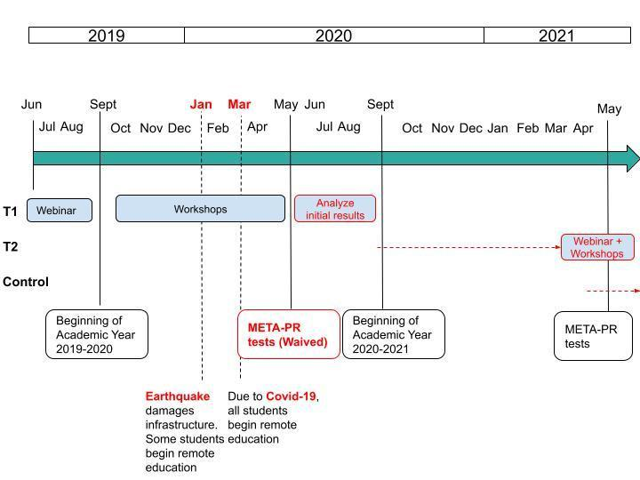

# Early Stage: Challenges to Administrative Data in Puerto Rico during COVID-19 {#puertorico}

```{r, echo=FALSE, results='asis'}
printauthor("puertorico")
```

## Summary


This chapter describes an important stage in an ongoing J-PAL
partnership with the Puerto Rico Department of Education (PRDE).
Researchers supported the implementation of an online diagnostic
assessment test, which took the place of standardized testing of
students of grades 3 to 8, and 11 in the subjects of math, English as a
second language, and Spanish. In addition to supporting an ongoing
randomized evaluation, the assessment offers an opportunity to measure
learning loss for future decision-making and research studies. It
describes this period of support, the broader relationship, and lessons
learned from working with state governments and administrative data.
Note that the work to implement the assessment was still in progress as
of November 2021, and the descriptions in this case study reflect the
current state of an evolving situation. The project received support
from the Innovations in Data and Experiments for Action Initiative
(IDEA), funded by the Alfred P. Sloan Foundation, during the COVID-19
pandemic to address the interruption to administrative data collection
critical to an ongoing research study.

## Introduction

An important advantage of using administrative data for research is that
data is usually already collected and stored for operational purposes.
From the researcher's perspective, this appears to occur automatically,
lowering the logistical burden and cost for researchers and
participants, ensuring near-universal coverage, and enabling long-term
follow-up. However, administrative data collection is not always
automatic or guaranteed. This case study describes a randomized
evaluation of a management training program for school principals in
Puerto Rico, which relies on standardized test scores collected by the
Department of Education to measure outcomes for students, principals,
and schools. The administration of standardized tests was halted by the
COVID-19 pandemic and a resultant shift to remote learning. At the time,
J-PAL North America had an ongoing partnership with the PRDE. The
response to the interrupted data collection --- here, the implementation of an
online diagnostic assessment test --- was made possible by recognizing
shared interests among researchers and education officials. Although
(hopefully) a once-in-a-lifetime occurrence, the pandemic response
offers lessons for research-practice partnerships where shifting
priorities or new crises may require adaptability.

The PRDE is responsible for managing about 845 state-operated schools
in Puerto Rico, with 292,518 students and 24,240 teachers, making it one
of the largest school districts in the United States by enrollment. In
Puerto Rico, 57 percent of children live in poverty and most children
have academic outcomes far worse than their peers in the mainland United
States even before the COVID-19 pandemic  [@mcfarland2019] (McFarland et al. 2019).

J-PAL North America has been involved in this research-practice
partnership since November 2016, when the PRDE was selected by J-PAL as
a State and Local Innovation Initiative partner, with improving
education identified as a focus area. J-PAL embedded an evaluation
officer in the PRDE to support the researchers and provided short-term
research management support that helped launch the following
intervention.

To improve management practices in Puerto Rican schools and thereby
improve student achievement, the PRDE collaborated with J-PAL affiliated
researchers Gustavo Bobonis, Marco Gonzalez-Navarro, Daniela Scur, and
Orlando Sotomayor in 2018 to design and implement a randomized
evaluation of a system-wide principal leadership management training
program called *Academia de Desarrollo Profesional de la Educación para
la Gestión de Liderazgo y la Profesionalización*[^puertorico1] (EDUGESPRO) using
administrative data collected by the PRDE.

Each cohort of principals is trained over the course of one academic
year (approximately 154 hours in total) through a series of 10 seminars
followed by 13 workshops and coaching throughout the academic year. The
program targets five managerial levers: educational leadership and
strategic long-term planning, instructional data-driven planning and
performance tracking, goal and target setting, school culture, and
personnel management. The evaluation relies on administrative data
collected by the PRDE, including student scores on the standardized test
known as Measurement and Evaluation for Education Transformation
(META-PR, from its acronym in Spanish).

As the evaluation has progressed, J-PAL and the PRDE have continued to
find ways to support and grow this partnership. During the period
described in this chapter, this included research management support by
J-PAL staff designed to identify opportunities to continue to measure
outcomes for the study in light of COVID-19. In practice, this led to
J-PAL supporting the implementation by the PRDE of an online diagnostic
assessment test for students, to measure learning during remote
education.

As part of a set of cases dedicated to the use of administrative data
for research, the focus on original data collection may seem an odd fit.
Administrative data, however, still must be collected and, as described
below, researchers may help contribute to that process. One way of
achieving the goal of increasing the use of administrative data for
evaluation is through developing stronger institutional partnerships
between researchers and data providers and implementing partners such as
governments. Supporting the partnership was the primary goal of the
research team during this period, and this has already paid dividends in
generating new data and launching new studies. Ultimately, the
assessment test was the PRDE's (not researchers') data collection
operation, conducted for its own operational purposes. Questions of
administrative data are addressed more fully at the end of this chapter.

This case first describes the randomized evaluation in more detail, how
J-PAL staff and affiliated researchers worked with the PRDE during the
COVID-19 pandemic, and lessons learned for collaborating with
governments and working with administrative data.

## Evaluation of EDUGESPRO


EDUGESPRO's evaluation is the core collaboration between the group of
researchers and the PRDE. To evaluate this program, school principals
were randomly assigned to one of three training cohorts to be offered
the opportunity to participate in the EDUGESPRO program in the summer of
2019 (T1), 2020 (T2), or 2021 (control). Exploiting the cohort-by-year
program design, researchers used a phase-in randomized evaluation,
meaning they randomly divided the group of principals in cohorts and
provided the training to each cohort one at a time to identify the
causal effects of the intensive management training on outcomes of
interest. One of the main outcomes of interest was student achievement
measured through annual standardized testing. As shown in the following
timeline, the interruption of standardized testing in May 2020 caused
delays and disruptions to the first analysis of the intervention's
results.

```{r puertorico1, echo=FALSE, out.width='100%', fig.cap='Timeline for Evaluation '}
if ( knitr::is_html_output() ) {
knitr::include_graphics('./assets/puertorico/puertorico1web.png')
}
if ( knitr::is_latex_output() ) {
    if ( ! file.exists('./figures/puertorico1.jpeg')) {
    file.copy('./assets/puertorico/puertorico1.jpeg','./figures/puertorico1.jpeg')
  }
  
}

```

### Data Used for Evaluation

The research team's intention was to use PRDE data on a broad array of
student, principal, and school characteristics as well as outcome data
for academic years 2011--2012 through 2021--2022. The data to be used by
the research team includes the following:

-   Student-level measures: test scores in Spanish, math, and English for grades 3 to 8 and 11; test scores in science for grades 4, 8, and 11; transcripts; class schedules; absences; disciplinary incidents; poverty status; and special needs status, among others.

-   Teacher- and principal-level measures: school and class assignments, attendance, professional history (tenure, educational degrees earned and where, prior assignments in the system).

-   School level measures: location (coordinates) of the school, grade span, infrastructure, accountability classification, student retention and graduation rates, and closure status.

Researchers executed a data-sharing agreement with the PRDE at the
beginning of the EDUGESPRO evaluation to receive this data for the
purpose of the study. This agreement went into effect when the
implementation of the evaluation started in 2018. The agreement works
both as a memorandum of understanding to establish the research-practice
partnership and a data-sharing agreement that specifies that the
research team can access the Department of Education's data for research
purposes. It also describes data security considerations like the fact
that all data is processed and stored in a secure server in the
University of Toronto. The researchers also intended to link PRDE
administrative data to Development World Management Survey results as
they concluded the different stages of the evaluation starting in 2018.

### Challenges

In early January 2020, a 6.4 magnitude earthquake hit Puerto Rico,
causing infrastructure damage and the temporary closure of many school
facilities. On March 16, 2020, the PRDE closed all school facilities and
announced that all learning would be remote until further notice due to
the COVID-19 pandemic. In response, school districts across the United
States, including Puerto Rico, requested and received waivers from the
US Department of Education for completing their mandatory annual
standardized tests. This waiver led the PRDE to decide not to administer
META-PR in May 2020, meaning that there are no records of student
performance since, in some cases, before the summer of 2019. The testing
waiver was implemented in recognition of the fact that states would not
be able to get fair, reliable, and valid assessment results given the
abrupt transition to online education [@devos2020] (Devos 2020).

Amid this challenging scenario, there was also an election for governor
in Puerto Rico, leading to personnel changes in the PRDE. This was a
challenge because new personnel were hired and had to get up to speed on
the department\'s efforts to gather evidence to inform COVID-19 response
policy.

After all schools closed in March 2020, EDUGESPRO's training program was
briefly suspended, but training resumed fully online in April as the
program had the potential to support principals during the pandemic.[^puertorico2]
The original schedule for the intervention had to be changed, so the
webinars and workshop for the second cohort were delayed from September
2020 until April 2021; however, the cohort-by-cohort approach to the
intervention is still proceeding in order.

Delaying standardized testing due to COVID-19 posed a significant
challenge for the study because the ability to draw causal comparisons
between cohorts exists only when some cohorts have yet to receive the
treatment. Moving outcome measurements to a later date while the
intervention is ongoing limits the comparisons that can be drawn. The
lack of META-PR at the end of the 2019--2020 school year meant there was
no opportunity to measure student gains after the first cohort of
principals received management training. After assessing whether grades
could be used, the research team concluded that the variation between
schools, classes, and grades would challenge the validity of any
comparisons.

Measuring student achievement was not the priority in a world looking to
adapt to the new COVID-19 reality. Given what was known about COVID-19
in March 2020, the priority was to contain the spread of the disease by
continuing school closures and avoiding the type of enclosed settings
traditionally used for in-person testing. However, a side effect of this
policy change was that ongoing research projects that required
standardized test score results were in jeopardy.

## Identifying Solutions to Data Disruptions


Even amid these critical short-term priorities, the PRDE, particularly
its Assessment Unit, knew that the lack of tests was going to impact the
way they think about education policy. They were committed to developing
an alternative that would allow them to understand the needs of the
students across the island to address them during and after the
pandemic. The solution was to implement an abridged version of the
META-PR test online as a diagnostic, low-stakes (i.e., not tied to
grades or graduation) assessment. The resulting data will provide
insight into students\' specific education needs and could also be
useful for current and future research.

To help implement the assessment, the Assessment Unit leveraged its
relationship with the research team and the shared interest in producing
data that could be used in lieu of standardized tests. In turn,
J-PAL-affiliated researchers and staff saw providing technical support
to the PRDE as an opportunity to strengthen and expand the
research-practice partnership in Puerto Rico.

### Why Was the Research Team a Trusted Partner?

Over the course of the EDUGESPRO evaluation, the research team
demonstrated that they shared common goals with the PRDE of improving
learning outcomes, reducing inequality in student academic achievement,
and providing high-impact professional development tools to the PRDE's
leaders.[^puertorico3] The EDUGESPRO evaluation was an active research project
involving close collaboration between researchers and the PRDE both when
the earthquakes hit the island and when schools closed in response to
COVID-19. Additionally, the project included an embedded evaluation
officer who works within the PRDE and closely with the operations
manager of the department's Institute for Professional Development. This
timing and close ties made the research team and the PRDE natural allies
in finding alternatives to the lack of standardized testing. Soon the
research team, in collaboration with research staff from J-PAL, started
directly supporting the PRDE's Assessment Unit, holding standing
meetings to discuss options to implement a test that students could
complete from their homes in the summer of 2020.

### Implementation Support

Our team joined an ad hoc working group that included the Assessment
Unit and the third-party testing provider. While the PRDE and the test
provider designed the test and online infrastructure, trained
administrators on how to use the system, dealt with technical issues,
and communicated plans to roll out the test to schools and families,
researchers provided assistance on several particular challenges.

One challenge was that tests had never been administered remotely. Here,
the research team supported the Assessment Unit by working on a schedule
to implement the test and suggested that they first implement a pilot
for grades 2 and 9 (grades that are not normally tested with the META-PR
test) to refine the approach and to be able to manage any questions from
school officials.

A second challenge was that many schools were not used to implementing
an online version of the test, although some had experience
administering the META-PR in computer labs rather than in paper form.
Here, the research team suggested pairing principals experienced in
online testing with other principals for support.

A third challenge was that given that the test would not be tied to
grades or graduation requirements, the research team anticipated low
take-up. For this reason, it also offered to monitor the test's
progression by analyzing participation rates while the test was being
implemented. Researchers developed automated reporting to principals
after the testing period with information on the percentage of English,
math, Spanish, and natural sciences sessions started or completed in
their schools. In addressing each of these challenges, the research team
made use of techniques similar to those used in managing the rollout of
a randomized evaluation.

### Results

The PRDE completed a pilot of the diagnostic assessment in April 2021
and plans to complete the full assessment by the end of October 2021.
Implementation happened slower than expected as ever-evolving pandemic
regulations and public health considerations shifted the testing
timeline on multiple occasions. In addition, legal and contractual
obligations with the test provider needed to be addressed before
implementation. Implementing the test occurred against a backdrop of
leadership changes due to the election, bandwidth constraints in the
Assessment Unit, and a pandemic, during which standardized testing was
not a top priority. In these circumstances, researchers were able to
provide additional bandwidth---such as creating plans for implementation
in light of the pilot's results---while being sensitive to established
processes that specified how this type of test could be created and
implemented.

While the assessment process is still ongoing, the EDUGESPRO study is
not over yet. Being flexible and supportive of the PRDE has helped
deepen the relationship between the PRDE, J-PAL, and the researchers.
The mutual trust needed to collaborate on research has been strengthened
through time spent cooperating on this challenge, which has opened
additional opportunities to do research. For example, Gustavo Bobonis
and Orlando Sotomayor, joined by Philip Oreopoulos and Román Andres
Zárate, have begun an evaluation with the PRDE of computer-assisted
learning to combat learning loss due to COVID-19. Bobonis and Sotomayor
connected with another agency, the Puerto Rico Department of Economic
Development and Commerce, which is now working with J-PAL, through the
State and Local Innovation Initiative, to develop an evaluation of
training in case management and soft skills for their workforce
development staff. J-PAL, the research team, and the PRDE are also
exploring ways to formalize an institutional partnership. Finally, J-PAL
staff continue to be involved in conversations on data governance and
making data accessible and usable for research with the PRDE. These
conversations are in early stages but hope to build on the work of the
EDUGESPRO evaluation, the diagnostic test implementation, and the
department's existing data-sharing infrastructure.

### Is This Administrative Data?

This case blurs the line between primary and secondary data collection.
On the one hand, this was a process to collect data for the PRDE's
operational purposes, based on the approach used in the existing
collection of META-PR standardized test data. On the other hand, the
research team was involved in the data collection process, with
usefulness for the evaluation of EDUGESPRO top of mind. Ultimately, what
the research team offered was support through the challenges posed by
the circumstances, and there was no additional data collection that
would specifically serve the purposes of their evaluation. Throughout
the whole process, the PRDE was always in charge of implementation and
changed plans as necessary as it navigated the bigger picture and
balanced educational needs and health and safety protocols. As a result,
many of the research team's suggestions did not end up being
implemented, such as the original testing schedule or a platform for
troubleshooting testing issues.

Nonetheless, this case is an important reminder that administrative data
still often must be actively collected before it can be used for
evaluation and research. Researchers familiar with data collection of
their own, as well as with the implementation of complex research, can
contribute to these efforts. Improving state data capacity is often
necessary for the delivery of an intervention as well as the measurement
of its effects. Researchers may have opportunities to consult on data
capacity building, even in more typical circumstances.

## Conclusions


### Benefits of the Diagnostic Test to Puerto Rico

The COVID-19 pandemic was not the first disruption of in-person learning
for students in Puerto Rico. The island's location makes it vulnerable
to hurricanes, earthquakes, and other natural disasters that have the
potential to disrupt education. Having a plan in place to develop and
implement an online test adds value beyond simply finding an alternative
to testing during a pandemic. The data collected during the diagnostic
test holds the possibility of better targeting student needs on the
island and quantifying learning loss. Additional research could also use
this data as a baseline to understand what efforts are effective at
improving student performance after the COVID-19 pandemic. The PRDE is
now better equipped to respond to new requirements from the federal
government, issued February 22, 2021, that school districts find ways to
administer standardized tests in 2021.

### Considerations for Working with Governments to Implement Administrative Data Collection

Despite the one-off nature of the collaboration, some lessons emerge
that may be useful given the opportunity to consult on administrative
data collection.

**Flexibility in the research-practice partnership, while maintaining
focus on the common goal, proved to be key**. Both the research team and
the Assessment Unit went well above their original agreements to set up
the infrastructure for this test. The disposition of researchers and
government officials was the basis for thinking about an alternative to
standardized testing. The process took months, several reviews from the
legal team, and multiple iterations to address implementation details,
but having in mind the common goal of understanding students' needs was
at the core of the strategy.

Iterating through every step of the process multiple times should be
expected. Flexibility is required here. Importantly, this can be a
helpful process as there are always new implementation details to
address and going through the whole process multiple times can support
the implementing partner in thinking about all possible scenarios.

**Identify constraints early**. The research team was able to provide
support thanks to the guidance of the Assessment Unit, who expressly
mentioned its constraints and flagged the activities in which it needed
support the most. The research team was able to provide additional
capacity that the PRDE did not have. For example, it could attend
meetings and start thinking about implementation details without needing
to go through an administrative approval process. It has also been able
to help the PRDE think through challenges generally. At the same time,
it was able to provide researcher-specific skills like additional
analysis that can improve data collection.

From the implementing partner's side, it was important to communicate
clearly about the legal steps needed to introduce a new process to
collect data. This process took months and required the PRDE's legal
team to review the contract with the testing provider several times
before approval. Additionally, it was necessary to clarify the
limitations within their purview. For example, the Assessment Unit
clarified at the beginning that it could not make the test mandatory or
assign any grade value to it as homework. This was key when thinking
about the test's implementation since it has implications for
researchers who should consider power and selection bias when assessing
the coverage of the data for research purposes.

**The support of the embedded evaluation officer was fundamental**.
Emily Goldman, evaluation officer, was a key part in coordinating
efforts between the research team and the PRDE. Her position gave her
both flexibility and legitimacy to work on planning the implementation
of the diagnostic test while considering the research team's needs.
Goldman's position existed for the purposes of the EDUGESPRO evaluation,
but she has been able to expand her support to the PRDE more generally.
Researchers may consider embedding staff on site either for specific
research projects or for building data capacity.[^puertorico4]

## Questions

In the following, we respond to the type of questions that relate the framing and structure of this project to the format of the Handbook. The questions can be taken to guide researchers in how to address the various points discussed throughout this Handbook.

###   Institutional setup

 > Who are the parties to the data access mechanism in this case study? Is the data provider also the data custodian/data host, or has a third party (data intermediary) taken on this role?

The parties to the data access mechanism are the PRDE and, in our case,
the University of Toronto (the researchers' institution). The data
warehouse is maintained by the PRDE, with the help of a contracted data
services company. Some data is initially collected by third-party
service providers like education testing companies, but these parties
are not parties to the research data access mechanism. All data used for
research is transferred by the PRDE to the research institution.

###   **Legal context for data use**

 > Are there any legal restrictions on who can be given access to the data? How were those legal restrictions satisfied (memorandums of understanding, data use agreements, etc.)?

All student records from elementary to postsecondary school are
protected by the Family Educational Rights and Privacy Act (FERPA).
Typically, FERPA requires individual consent from students and/or their
guardians to release records. FERPA restrictions would not apply to
teacher, principal, or school level records. The PRDE's *Manual de
Gobernanza de Datos* (*Data Governance Manual*) [@puertoricodepartamentodeeducacion2016] specifies which
individuals or entities oversee data protection and privacy as well as
the guidelines and best practices to comply with FERPA. The PRDE executes data-sharing
agreements following procedures detailed in the *Data Governance Manual*
and all these agreements follow FERPA principles. In the case of this
study, researchers obtained consent for use of student records.

b.  Have any memorandums of understanding, data use agreements, etc. been generalized, or are they still specific to this partnership? What guidance could you give to the next party wanting to negotiate a memorandum of understanding or data use agreement with the same data provider?

The PRDE has an established process by which researchers may request
data from the department, which is detailed in the *Data Governance
Manual*. The appendices in the manual contain a data request form,
confidentiality and data disclosure agreements, and a data destruction
form that must be completed at the end of a project. Each party
requesting data will need to execute an agreement customized to its data
request.

For the EDUGESPRO study and the broader research-practice partnership,
the PRDE and the University of Toronto first executed a data-sharing
agreement in 2018. A University of Toronto template was used rather than
the PRDE template, but the agreements contain all of the elements that
the PRDE requires. When executing data-sharing agreements, J-PAL
recommends starting with a template that at least one party is already
comfortable with.

The 2018 agreement has served as a master data-sharing agreement for the
partnership, with the appendices containing study-specific research
descriptions and data requests (years of data, variables, and any
specifics of data linkages and transfers). The 2018 agreement contains
an appendix for the EDUGESPRO evaluation, and a second appendix was
added in 2021 for the computer-assisted learning evaluation. This
particular arrangement may not be generalizable and owes to the fact
that the institutions that are party to the agreements have not changed
and the investigator teams and data needs for each study are broadly
similar. Other researchers should generally expect to execute complete
and unique agreements for each research study or data request they
undertake. However, it is likely that subsequent data requests from the
same data provider may proceed more quickly once an initial relationship
has been established.

###   **Making data usable for research**

 > Have the partners completed the process of making the data usable for research? If not, is it taking longer than expected or is it on track? What obstacles were encountered and how were they addressed? Who is handling this part: the data provider, the researcher team, or a joint working group?

Data from the diagnostic test is not yet available since the test has
not been fully administered. However, as with the information collected
from the META-PR tests, once the data on student performance is
collected, it will be processed by the PRDE and added to the
centralized, cloud-based data warehouse. The information will then
become available to researchers who have established a data-sharing
arrangement with the department.

Based on previous transfers of administrative data early in the project,
it appears that data is transferred in quite raw form. Researchers
should plan significant time for validating, cleaning, and wrangling the
data into usable form. Researchers should also take care to ensure that
the data has been sufficiently de-identified before analysis.

*The following questions will explore how you are planning to protect
the information of the people and business in the data and to frame
allowable research (rough alignment with the "Five Safes" principles).*

###   **Expanding access**

 > Are you planning, or is your project considering, to expand access to other researchers? If yes, how do you plan to select projects, researchers, and institutions that will be granted (secure) access? If not, then please discuss what you feel are the constraints to doing so in this case. \[Handles safe people/safe projects and touches on safe outputs; also legal context for data use\]

Researchers can request access to the PRDE data by completing a [Request
for Statistical
Data](https://www.de.pr.gov/wp-content/uploads/2018/01/Manual_de_Gobernanza_de_Datos_-en_proceso_para_revisin_-5.pdf)
as shown in Appendix A (pp. 52--53) of the *Data Governance Manual*. The
request should specify what data is requested, what level of data
researchers will use (e.g., student or school level), and the reason for
the request. Data at the student level can only be released if the
researcher completes a data confidentiality agreement and a data
disclosure agreement. After study completion, researchers will also need
to fill out a guarantee form of data and confidential information
destruction. The request form is not specific to research and is
designed to accommodate requests from parents, media, or other members
of the community as well. Researchers should also have obtained their
institution's institutional review board approval if conducting human
subject research.

Because it was part of the original pilot data access, and as trusted
partners, the J-PAL-based research team continues to be involved in
ongoing discussions related to data governance. However, all data access
is controlled by the PRDE.

###   **Technical setup**

 > Are you planning to require access through particular technical means (remote access, designated secure computers, computer security plan), and/or particular legal means (enforceable laws or contracts/data use agreements under local law)? \[Handles safe settings but also legal framework for granting data access\]

The generic memorandum of understanding/data use agreement adapted for
this partnership indicates that the PRDE will transfer data to
researchers through a secure file transfer protocol, an encrypted
cloud-based solution, or an encrypted hard drive. All the data retrieved
from the data warehouse must be stored and analyzed through a secure
server, and it cannot leave the hosting institution's premises. In the
case of this project, that server is located at the University of
Toronto. This means that no data is available on researcher laptops, and
all access is remote, using Windows- or Linux-based access methods.
Additionally, each authorized user must be assigned a unique username
and password to access the data.

###   **De-identification and similar**

 > If you are currently working with detailed confidential data, will others in the future be able to access the same data, or will accessible data be modified to provide "safe" access in compliance with local privacy and data use laws? Examples of such modifications include (but are not limited to) redacting, de-identifying, or aggregating the data for ethical and data security reasons before sharing.

Researchers are working with de-identified, individual-level data, which
cannot be shared beyond the project team. Any published results or data
must be aggregated to cell sizes of at least five individuals to
maintain confidentiality of potentially re-identifiable subgroups. Other
researchers would need to request individual-level data directly from
the department, following the relevant data access procedures addressed
above.

###   **Data life cycle and replicability**

 > Have you given thought to the preservation of data used and generated by this project, the future reproducibility of derivative data products (including protected data), and the research that used such data? Could future researchers recover data that you are currently using? \[Touches on data life cycle and replicability\]

The ad hoc diagnostic test was only intended to be implemented once;
however, because the results will be integrated in the central data
warehouse, researchers other than those currently working on the
assessment's implementation will be able to access this data in the
future. This data will be crucial to measuring learning loss during the
disruption caused by the world pandemic. Data held by the research team
must be destroyed at the conclusion of the research project, but the
original data will be held in the data warehouse for an indeterminate
length of time. This information is not currently in the governance
manual.

###   **Sustainability and continued success**

 > Have you given thought to the sustainability of the effort, both financial sustainability (covering costs of making data accessible in the long run) and institutional buy-in (satisfying legal and societal expectations of benefits)? \[Addresses sustainability and continued success\]

Currently, there is no cost associated with acquiring PRDE data;
however, the PRDE has a limited ability to clean and harmonize data,
link data sets, or produce analysis.

Thinking more broadly about sustainability, as noted in the case, the
research team and the department have invested significant time and
effort in capacity building and in conducting collaborative research.
These efforts and costs are not well accounted for when thinking only
about the data access mechanism. In particular, embedding staff in the
department (who have direct access to the data warehouse) has been
essential to the smooth conduct of the study, and similar approaches
(and related costs) should be considered when conducting future
research.

To ensure sustainability and continued success, researchers should
approach collaboration with the department from the perspective of
shared objectives, such as improving education on the island and
improving evidence-based decision-making, such that data relationships
continue to be mutually beneficial.

## About the Authors


Daniela Gómez Treviño is a Research Manager at J-PAL North America where
she supports the launch of new evaluations of social programs, and
contributes to training courses for research staff. She also supports
multiple impact evaluations through Research Management Support (RMS).

## RRRReferences


Bobonis, Gustavo and Nicolas Riveros Medelis. 2019. "Policymakers and
Researchers Collaborate to Improve Education Quality in Puerto Rico."
J-PAL Blog.
[[https://www.povertyactionlab.org/blog/7-9-19/policymakers-and-researchers-collaborate-improve-education-quality-puerto-rico]{.underline}](https://www.povertyactionlab.org/blog/7-9-19/policymakers-and-researchers-collaborate-improve-education-quality-puerto-rico).

Devos, Betsy. 2020. "Secretary Betsy Devos to Chief State School
Officers." US Department of Education.
[[https://www2.ed.gov/policy/gen/guid/secletter/200320.html]{.underline}](https://www2.ed.gov/policy/gen/guid/secletter/200320.html).

McFarland, Joel, Bill Hussar, Jijun Zhang, Xiaolei Wang, Ke Wang, Sarah
Hein, Melissa Diliberti, Emily F. Cataldi, Farrah B. Mann, and Amy
Barmer. 2019. "The Condition of Education 2019 (NCES 2019-144)."
Washington, DC: National Center for Education Statistics.
[[https://nces.ed.gov/
pubsearch/pubsinfo.asp?pubid=2019144]{.underline}](https://nces.ed.gov/).

Puerto Rico Departamento de Educación. 2016. "Manual de Gobernanza de
Datos del Departamento de Educación del Estado Libre Asociado de Puerto
Rico."
[[https://www.de.pr.gov/wp-content/uploads/2018/01/Manual\_de\_Gobernanza\_de\_Datos\_-en\_proceso\_para\_revisin\_-5.pdf]{.underline}](https://www.de.pr.gov/wp-content/uploads/2018/01/Manual_de_Gobernanza_de_Datos_-en_proceso_para_revisin_-5.pdf).

Sachse, Clare. "Real-Time Monitoring and Response Plans: Creating
Procedures." J-PAL Research Resources. Accessed XX.
[[https://www.povertyactionlab.org/resource/real-time-monitoring-and-response-plans-creating-procedures]{.underline}](https://www.povertyactionlab.org/resource/real-time-monitoring-and-response-plans-creating-procedures).

Varela Vélez, Damarys, Emily Goldman, and Gustavo
Bobonis. 2021.
"Pursuing Evidence-Based Policymaking during Crisis." J-PAL Blog.
[[https://www.povertyactionlab.org/blog/3-23-21/pursuing-evidence-based-policymaking-during-crisis]{.underline}](https://www.povertyactionlab.org/blog/3-23-21/pursuing-evidence-based-policymaking-during-crisis).

[^puertorico1]: In English, Education Professional Development for Leadership and
    Professionalization Management Academy.

[^puertorico2]: @varelavelez-blog
    [document in more detail](https://www.povertyactionlab.org/blog/3-23-21/pursuing-evidence-based-policymaking-during-crisis) how the program has shifted to respond to
    the crisis.

[^puertorico3]: @bobonis2019 document
    how policymakers and researchers collaborated to improve education
    quality in Puerto Rico.

[^puertorico4]: See @sachsse-blog.


```{block, type='invisible'}
This is a workaround for citations in footnotes, please ignore.
@sachsse-blog
@bobonis2019
@varelavelez-blog
```

\putbib