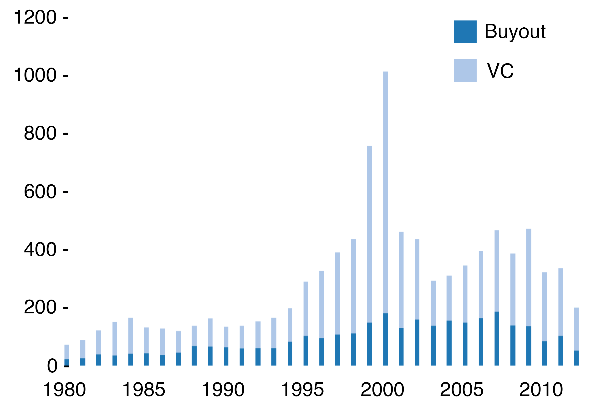
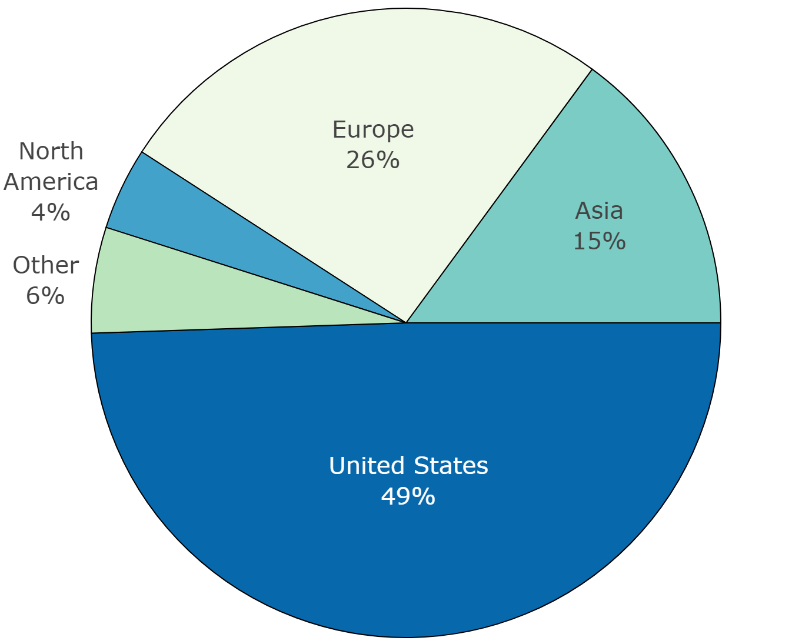
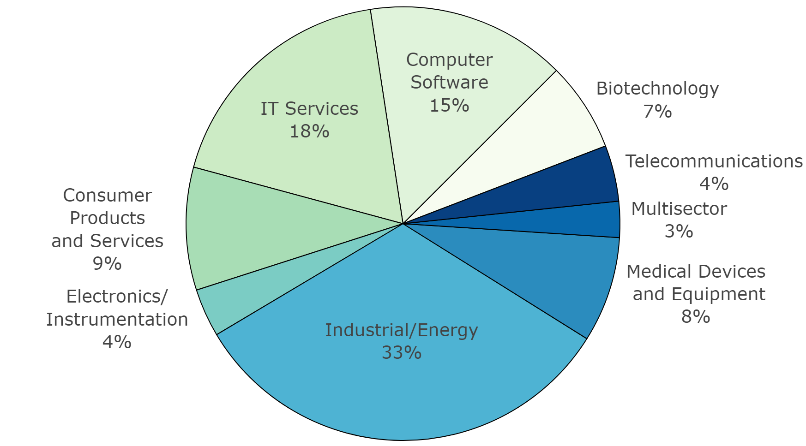

### Appendix A

**Summary Information of the PCRI Private Capital Database**

This is a summary overview of the data collected on private capital firms, funds, and portfolio companies. In particular, the PCRI focuses on buyouts, growth equity, and venture capital investing. These charts are from [@jeng2015].

```{r pcrifigurea1, echo=FALSE, out.width='100%', fig.cap='Number of Private Capital Firms By Year Founded'}

```

|Regions|1980-1989|1990-1999|2000-2009|2010-2015|Total|
|:---------------:|:---------:|:---------:|:---------:|:---------:|:---------:|
| Africa | 0.3% | 1.3% | 1.7% | 1.0% | 1.3% |
| Asia | 9.0% | 10.4% | 18.2% | 27.6% | 15.3% |
| Eurasia | 0.0% | 0.6% | 1.0% | 2.3% | 0.9% |
| Europe | 22.0% | 24.5% | 27.1% | 22.0% | 25.2% |
| Middle East | 1.0% | 2.4% | 2.7% | 1.9% | 2.3% |
| Multigreography | 0.1% | 0.0% | 0.2% | 0.2% | 0.1% |
| North America | 4.1% | 5.6% | 5.5% | 4.6% | 5.2% |
| Oceania | 1.2% | 2.2% | 1.9% | 0.9% | 1.8% |
| South Ameica |0.5% | 1.1% | 1.7% | 1.7% | 1.4% |
| United States | 62.9% | 51.8% | 40.1% | 37.9% | 46.5% |
Table: (\#tab:pcritablea1) Private Capital Firms by Location of Company Headquarters Split by Year Founded

|Fund Type|1980-1989|1990-1999|2000-2009|2010-2015|Total|
|:---------------:|:---------:|:---------:|:---------:|:---------:|:---------:|
| Buyout | 19.0% | 26.0% | 27.3% | 26.4% | 26.1% |
| Growth Equity | 0.9% | 0.7% | 1.9% | 8.5% | 2.3% |
| Other | 21.5% | 9.4% | 14.2% | 11.9% | 13.4% |
| Second | 0.1% | 0.4% | 0.3% | 0.2% | 0.3% |
| VC | 58.6% | 63.6% | 56.3% | 53.0% | 57.9% |
Table: (\#tab:pcritablea2) Breakdown of Funds by Investment Type Split by Vintage Year

```{r pcrifigurea2, echo=FALSE, out.width='100%',fig.cap='Fund Breakdown by Region (%)'}

```


```{r pcrifigurea3, echo=FALSE, out.width='100%', fig.cap='Fund Breakdown by Industry (%)'}

```

**Table A.3**


|Regions|1980-1989|1990-1999|2000-2009|2010-2015|
|:---------------:|:---------:|:---------:|:---------:|:---------:|
| Africa | 0.6% | 0.6% | 0.5% | 0.1% |
| Asia | 11.5% | 13.5% | 14.9% | 10.3% |
| Eurasia | 0.1% | 0.5% | 0.5% | 2.2% |
| Europe | 31,2% | 25.8% | 30.3% | 32.5% |
| Middle East | 0.9% | 1.4% | 1.8% | 1.9% |
| Multigreography | 0.0% | 0.0% | 0.0% | 0.0% |
| North America | 7.3% | 4.9% | 3.7% | 2.8% |
| Oceania | 2.5% | 1.5% | 1.2% | 0.6% |
| South Ameica |0.7% | 0.8% | 0.7% | 0.6% |
| United States | 45.2% | 51.1% | 46.4% | 49.0% |
Table: (\#tab:pcritablea3) Portfolio Companies by Location: Companies by Region, Split by Year Founded
