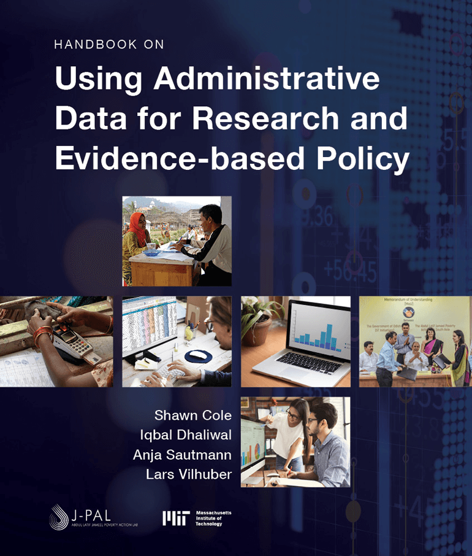

```{r setup,include=FALSE}
source("_setup.R",echo=FALSE)
```

# Welcome to the Handbook {-}

```{r coiver, echo=F,  out.width="100%"}

```

This is the online version of the Handbook on Using Administrative Data for Research and Evidence-based Policy. This Handbook intends to inform data providers and researchers on how to provide privacy-protected access to, handle, and analyze administrative data. Available publicly, the Handbook provides guidance on data access requirements and procedures, data privacy, data security, regulations for public data use, data architecture, data use and storage, cost structure and recovery, ethics and privacy-protection, making data accessible for research, and dissemination for restricted access use. The Handbook serves as a resource for all researchers looking to work with administrative data and for data providers looking to make such data available.

# About Us {-}

## About the Editors {-}

### Shawn Cole {-}

Shawn Cole is the John G McLean Professor of Business Administration at Harvard Business School. Shawn is a Co-Chair of J-PAL's Innovations in Data and Experiments for Action Initiative (IDEA). His research examines agriculture, corporate finance, banking, and consumer finance in developing countries. He has conducted randomized evaluations in education, financial literacy, agricultural risk management, and ICT for agriculture. He received a Ph.D. in economics from the Massachusetts Institute of Technology in 2005, where he was an NSF and Javits Fellow, and an A.B. in Economics and German Literature from Cornell University.

### Iqbal Dhaliwal {-}

Iqbal Singh Dhaliwal is the Global Executive Director of J-PAL. He works with the Board of Directors to develop the organization’s strategic vision, and with the leadership of the six regional offices to coordinate J-PAL’s worldwide research, policy outreach, capacity building, and operations. He is a Co-Chair of IDEA. He began his career in public service as a member of the Indian Administrative Service (IAS), in which he served as a Deputy Secretary in a state government, director of a statewide welfare department, and CEO of a publicly owned company. He has a BA in economics from the University of Delhi, an MA in economics from the Delhi School of Economics, and an MPA in international development from Princeton School of Public and International Affairs.

### Anja Sautmann {-}

Anja Sautmann is a Research Economist in the World Bank's Development Research Group (Human Development Team). She is interested in how households and individuals make decisions, from healthcare for children to daily consumption to marriage, and how incentives and individual behavior shape optimal policy design. Before joining the World Bank, Anja was an Assistant Professor at Brown University (2010-2017) and the Director of Research, Education, and Training at the Abdul Latif Jameel Poverty Action Lab at MIT (2017-2020) and Director of IDEA. She received her Ph.D. in Economics from New York University and her diploma in Economics from Ludwig Maximilians Universität in Munich, Germany. She is an affiliate of the CESifo research network.

### Lars Vilhuber {-}

Lars Vilhuber is the Executive Director of the Labor Dynamics Institute at Cornell University, and a faculty member in Cornell University’s Economics Department. He is also the American Economic Association’s Data Editor. Lars is a Co-Chair of IDEA. His research interests relate to the dynamics of the labor market. He also has extensive experience in the application of privacy-preserving publication and access to restricted data. He is chair of the scientific committee of the French restricted-access system [CASD](https://casd.eu), member of the governing board of the Canadian Research Data Centre Network ([CRDCN](https://crdcn.org)), and incoming chair of the  American Statistical Association‘s [Committee on Privacy and Confidentiality](https://community.amstat.org/cpc/home).  Lars has an undergraduate degree in Economics from Universität Bonn and a Ph.D. in Economics from Université de Montréal.

## About J-PAL {-}

The Abdul Latif Jameel Poverty Action Lab (J-PAL) is a global research center working to reduce poverty by ensuring that policy is informed by scientific evidence. Anchored by a network of more than 225 affiliated professors at universities around the world, J-PAL draws on results from randomized impact evaluations to answer critical questions in the fight against poverty. We build partnerships with governments, NGOs, donors, and others to share this knowledge, scale up effective programs, and advance evidence-informed decision-making. J-PAL was launched at the Massachusetts Institute of Technology in 2003 and has regional centers in Africa, Europe, Latin America & the Caribbean, the Middle East & North Africa, North America, South Asia, and Southeast Asia.
